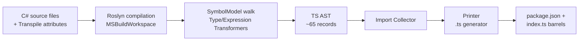
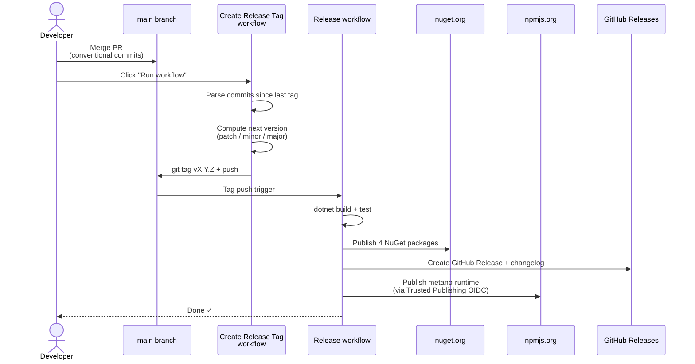

# Metano

**A C# → TypeScript transpiler powered by Roslyn.** Write your domain model, DTOs,
LINQ queries, and business logic in C#. Get idiomatic, fully-typed, dependency-free
TypeScript that runs in any modern JS environment.

[](https://www.nuget.org/packages/Metano/)
[](https://www.npmjs.com/package/metano-runtime)
[](https://opensource.org/licenses/MIT)

---

## Table of Contents

- [Why Metano?](#why-metano)
- [How Metano differs from previous C# → JS/TS tools](#how-metano-differs-from-previous-c--jsts-tools)
- [Key Features](#key-features)
- [Quick Example](#quick-example)
- [Tech Stack](#tech-stack)
- [Prerequisites](#prerequisites)
- [Getting Started](#getting-started)
- [Project Structure](#project-structure)
- [How It Works](#how-it-works)
- [Key Concepts](#key-concepts)
- [Available Commands](#available-commands)
- [Testing](#testing)
- [Samples](#samples)
- [Publishing & Releases](#publishing--releases)
- [Troubleshooting](#troubleshooting)
- [Contributing](#contributing)
- [License](#license)

---

## Why Metano?

If you have a C# backend and a TypeScript frontend, you end up maintaining the same
domain concepts twice: entities, enums, DTOs, validation rules, small calculations.
Keeping them in sync is a constant source of drift, bugs, and friction.

Metano treats your C# code as the source of truth and generates the TypeScript
automatically — not hand-written type definitions, **actual working TypeScript code**:
classes with methods, records with `equals`/`hashCode`/`with`, LINQ-style queries,
pattern matching, type guards, and JSON serialization.

It's designed for teams that want:

- **One source of truth** for domain types and logic shared across backend and frontend
- **Strong types** on both sides without manually syncing them
- **Idiomatic output** — not transpiled gibberish, real TypeScript you'd be proud to write
- **Zero runtime overhead** where possible (branded types, string unions, plain arrays)

---

## How Metano differs from previous C# → JS/TS tools

C# has a long history of "run .NET in the browser" projects — **Bridge.NET**, **H5**
(a Bridge fork), **SharpKit**, **JSIL**, and more recently **Blazor WebAssembly**.
They all solved variations of a similar problem, but with trade-offs Metano is
explicitly trying to avoid.

**Bridge.NET and its descendants** ported a large chunk of the .NET BCL into
JavaScript so that almost any C# code would just run. The output worked, but it
dragged in a heavy runtime, emitted code that looked nothing like hand-written
JavaScript, and made interop with the existing JS ecosystem awkward. You ended up
with "C# pretending to be JS" instead of real JavaScript.

**Blazor WebAssembly** took a different route: ship the .NET runtime itself to
the browser as a WASM binary and run the original C# IL. That preserves full C#
fidelity but gives you a multi-megabyte download and makes sharing types with
regular JS/TS code painful — you're living in a separate world.

**API codegen tools** like NSwag and Swagger Codegen only generate TypeScript
*type declarations* from an OpenAPI contract. They solve the schema sync problem
but give you nothing on the behavior side: no methods, no validation, no domain
logic, just `interface` stubs.

**Fable** (F# → JS/TS) is the closest spiritual neighbor — it aims for idiomatic
output and is a great project. Metano applies the same philosophy to C#, which
is the mainstream language for .NET backends.

### Metano's philosophy

**Share code *and* behavior, not just types.** Records, classes, methods, LINQ
queries, pattern matching, exceptions — if it compiles in C#, the transpiler
tries to give you real working TypeScript with the same semantics.

**Output should be as good as hand-written TypeScript.** No `__mscorlib` global,
no heavyweight runtime, no unreadable mangled names. The generated `.ts` files
use normal classes, normal `import` statements, idiomatic naming, and tree-shake
cleanly. You should be able to open one and say "yeah, I'd have written this the
same way". The only runtime dependency is `metano-runtime`, a small npm package
with the minimum viable helpers (HashCode, LINQ, HashSet, primitive type guards,
optional JSON serializer) — and even then only for features that actually need it.

**Accept some restrictions, deliberately.** Metano doesn't try to transpile
*every* C# feature under the sun. You mark specific types with `[Transpile]` (or
opt the whole assembly in with `[assembly: TranspileAssembly]`), and the
transpiler covers the language surface most teams use for domain code: records,
classes, inheritance, interfaces, generics, LINQ, pattern matching,
async/await, exceptions, nullable types. Reflection-heavy code, dynamic
dispatch, and unsafe blocks are out of scope. This is a conscious trade-off —
restricting the input lets the output stay clean.

**Zero runtime cost where possible.** `[StringEnum]` compiles to a `const` object
with no wrapper. `[InlineWrapper]` gives you branded primitives — `UserId` is
literally a `string` at runtime. `[PlainObject]` emits plain interfaces so DTOs
round-trip through `JSON.stringify` without ceremony. The defaults are chosen so
that the generated code is roughly as fast as what you'd write by hand.

**Work *with* the JS ecosystem, not against it.** External npm packages are
first-class: declare a C# facade with `[Import(from: "some-package")]` and the
transpiler emits real `import` statements and wires up `package.json#dependencies`.
You can wrap Hono, React, Zod, or any other JS library and use it from C# without
the transpiler ever trying to model those packages internally.

Metano won't replace Blazor if you want full .NET in the browser, and it won't
replace NSwag if you only need type stubs from an API contract. It fills the
middle ground: **shared domain code between a .NET backend and a TypeScript
frontend, with clean output and no runtime penalty.**

---

## Key Features

### Language features

- **Records** → TS classes with `equals()`, `hashCode()`, `with()`, structural equality
- **Classes and inheritance** with `super()` calls, virtual methods, and overrides
- **Enums** → numeric enums OR string unions (via `[StringEnum]`)
- **Interfaces** (including generic `IEntity<T>`) → TypeScript interfaces
- **Generics with constraints** (`where T : IEntity` → `T extends IEntity`)
- **Pattern matching** (`switch` statements and expressions, `is` patterns, property patterns)
- **Nullable types** — both reference (`string?`) and value (`int?`) with `| null`
- **Async/await** — `Task<T>` / `ValueTask<T>` → `Promise<T>`
- **Exceptions** → `class extends Error`
- **Operators** (`==`, `+`, unary, etc.) → `__op` static helpers
- **Extension methods** (including C# 14 extension blocks)
- **Nested types** via companion namespace declaration merging

### Collections & LINQ

- `List<T>` / `IList<T>` → `T[]`
- `Dictionary<K,V>` → `Map<K,V>`
- `HashSet<T>` → custom `HashSet` with structural equality (from `metano-runtime`)
- `ImmutableList<T>` / `ImmutableArray<T>` → `T[]` with pure helper functions
- `Queue<T>` / `Stack<T>` → `T[]` with push/shift/pop
- **Full LINQ runtime** with lazy evaluation: `where`, `select`, `selectMany`, `orderBy`,
  `groupBy`, `distinct`, `take`, `skip`, `zip`, `union`, `intersect`, `except`,
  `aggregate`, `first`, `single`, `any`, `all`, etc.

### BCL type mappings

- `DateTime` → `Temporal.PlainDateTime`
- `DateOnly` → `Temporal.PlainDate`
- `TimeOnly` → `Temporal.PlainTime`
- `DateTimeOffset` → `Temporal.ZonedDateTime`
- `TimeSpan` → `Temporal.Duration`
- `decimal` → `Decimal` (from `decimal.js`, arbitrary precision)
- `Guid` → `UUID` (branded `string`, from `metano-runtime`)
- `BigInteger` → `bigint`

### Control knobs via attributes

| Attribute                       | Purpose                                                |
| ------------------------------- | ------------------------------------------------------ |
| `[Transpile]`                   | Mark a type for transpilation                          |
| `[assembly: TranspileAssembly]` | Transpile all public types in the assembly             |
| `[NoTranspile]`                 | Exclude from transpilation                             |
| `[StringEnum]`                  | Emit enum as string union instead of numeric           |
| `[Name("x")]`                   | Rename type/member in TS output                        |
| `[Ignore]`                      | Omit member from output                                |
| `[InlineWrapper]`               | Struct → branded primitive (zero-cost type safety)     |
| `[PlainObject]`                 | Record/class → TS interface (no class wrapper)         |
| `[ExportedAsModule]`            | Static class → top-level functions                     |
| `[GenerateGuard]`               | Generate `isTypeName()` runtime type guard             |
| `[ModuleEntryPoint]`            | Method body becomes top-level module code              |
| `[EmitPackage("name")]`         | Declare npm package identity for cross-project imports |
| `[EmitInFile("name")]`          | Co-locate multiple types in one `.ts` file             |
| `[Import]` / `[ExportFromBcl]`  | Map C# type to an external JS module                   |
| `[Emit("$0.foo($1)")]`          | Inline JS at call sites with argument placeholders     |
| `[MapMethod]` / `[MapProperty]` | Declarative BCL method/property → JS mapping           |

### Cross-project support

When one C# project references another with `[assembly: EmitPackage("name")]`, Metano
automatically:

1. Discovers transpilable types from the referenced assembly
2. Resolves cross-package imports (`import { Foo } from "name/subpath"`)
3. Adds the dependency to the consumer's `package.json` with the correct version

### JSON serialization

Metano transpiles `System.Text.Json.Serialization.JsonSerializerContext` subclasses into a
TypeScript `SerializerContext` with pre-computed `TypeSpec` definitions. JSON property
names, naming policies (`CamelCase`, `SnakeCaseLower`, etc.), and per-property
overrides are all resolved at compile time.

```csharp
[JsonSourceGenerationOptions(PropertyNamingPolicy = JsonKnownNamingPolicy.SnakeCaseLower)]
[JsonSerializable(typeof(TodoItem))]
public partial class JsonContext : JsonSerializerContext;
```

Becomes a TS `SerializerContext` with a `JsonSerializer.serialize` / `deserialize` API
that handles `Temporal` types, `Decimal`, `Map`, `HashSet`, branded types, and
nested objects transparently.

---

## Quick Example

**Input** — `samples/SampleTodo/TodoItem.cs`:

```csharp
using Metano.Annotations;

[assembly: TranspileAssembly]
[assembly: EmitPackage("sample-todo")]

namespace SampleTodo;

[StringEnum]
public enum Priority
{
    [Name("low")] Low,
    [Name("medium")] Medium,
    [Name("high")] High,
}

public record TodoItem(string Title, bool Completed = false, Priority Priority = Priority.Medium)
{
    public TodoItem ToggleCompleted() => this with { Completed = !Completed };
    public TodoItem SetPriority(Priority priority) => this with { Priority = priority };
    public override string ToString() => $"[{(Completed ? "x" : " ")}] {Title} ({Priority})";
}
```

**Output** — `js/sample-todo/src/todo-item.ts`:

```typescript
import { HashCode } from "metano-runtime";
import { Priority } from "./priority";

export class TodoItem {
  constructor(
    readonly title: string,
    readonly completed: boolean = false,
    readonly priority: Priority = "medium",
  ) {}

  toggleCompleted(): TodoItem {
    return this.with({ completed: !this.completed });
  }

  setPriority(priority: Priority): TodoItem {
    return this.with({ priority });
  }

  toString(): string {
    return `[${this.completed ? "x" : " "}] ${this.title} (${this.priority})`;
  }

  equals(other: any): boolean {
    return (
      other instanceof TodoItem &&
      this.title === other.title &&
      this.completed === other.completed &&
      this.priority === other.priority
    );
  }

  hashCode(): number {
    const hc = new HashCode();
    hc.add(this.title);
    hc.add(this.completed);
    hc.add(this.priority);
    return hc.toHashCode();
  }

  with(overrides?: Partial<TodoItem>): TodoItem {
    return new TodoItem(
      overrides?.title ?? this.title,
      overrides?.completed ?? this.completed,
      overrides?.priority ?? this.priority,
    );
  }
}
```

And `js/sample-todo/src/priority.ts`:

```typescript
export const Priority = {
  Low: "low",
  Medium: "medium",
  High: "high",
} as const;

export type Priority = (typeof Priority)[keyof typeof Priority];
```

---

## Tech Stack

| Layer              | Technology                                                |
| ------------------ | --------------------------------------------------------- |
| .NET SDK           | 10.0 (C# 14, preview features)                            |
| Transpiler         | Roslyn 5.3.0 (Microsoft.CodeAnalysis)                     |
| CLI Framework      | ConsoleAppFramework                                       |
| .NET Testing       | TUnit (Microsoft.Testing.Platform)                        |
| Formatter (C#)     | CSharpier                                                 |
| Versioning         | MinVer (git-tag-based SemVer)                             |
| Release automation | dotnet-releaser                                           |
| JS Runtime         | Bun + `tsgo` (TypeScript native preview)                  |
| JS Package         | `metano-runtime` (HashCode, LINQ, HashSet, serialization) |
| JS Testing         | `bun:test`                                                |
| Formatter (JS)     | Biome                                                     |
| Package management | Central Package Management + Bun workspaces               |

---

## Prerequisites

- **.NET SDK 10.0** (preview) — install via [dotnet.microsoft.com](https://dotnet.microsoft.com/download/dotnet/10.0)
- **Bun 1.3+** — install from [bun.sh](https://bun.sh)
- **Git 2.30+**
- macOS, Linux, or Windows

> **Note:** Metano uses C# 14 preview features. It requires the .NET 10 SDK specifically
> (pinned via `global.json`).

---

## Getting Started

### 1. Clone the repository

```bash
git clone https://github.com/danfma/metano.git
cd metano
```

### 2. Restore .NET tools

```bash
dotnet tool restore
```

This installs `csharpier` (formatter), `husky` (git hooks), and `dotnet-releaser`
(release automation) as local tools.

### 3. Build the solution

```bash
dotnet build
```

This builds the transpiler **and** auto-runs it on the sample projects (via the
`Metano.Build` MSBuild integration), generating fresh TypeScript in `js/sample-*/src`.

### 4. Install JS dependencies

```bash
cd js && bun install && cd ..
```

The `js/` folder is a Bun workspace with four packages: `metano-runtime` (the shared
runtime library) and the three generated sample outputs.

### 5. Run the tests

```bash
# .NET tests (TUnit — use `dotnet run`, not `dotnet test`)
dotnet run --project tests/Metano.Tests/

# JS runtime tests
cd js/metano-runtime && bun test

# Sample end-to-end tests
cd js/sample-todo && bun test
cd js/sample-todo-service && bun test
cd js/sample-issue-tracker && bun test
```

You should see around **330 .NET tests** and **320+ JS tests** passing.

### 6. Transpile your own project (optional)

```bash
dotnet run --project src/Metano.Compiler.TypeScript/ -- \
  -p path/to/YourProject.csproj \
  -o path/to/output/src \
  --clean
```

Or, add the `Metano.Build` NuGet package to your `.csproj` to wire the transpilation
into your normal `dotnet build` loop.

---

## Project Structure

```
metano/
├── src/
│   ├── Metano/                       # Attributes + BCL runtime mappings
│   │   ├── Annotations/              # [Transpile], [StringEnum], [Name], etc.
│   │   └── Runtime/                  # Declarative [MapMethod]/[MapProperty] for BCL
│   ├── Metano.Compiler/              # Target-agnostic core library
│   │   ├── ITranspilerTarget.cs      # Interface every language target implements
│   │   ├── TranspilerHost.cs         # Orchestrates load → compile → transform → write
│   │   ├── SymbolHelper.cs           # Target-agnostic Roslyn helpers
│   │   └── Diagnostics/              # MetanoDiagnostic (MS0001–MS0008)
│   ├── Metano.Compiler.TypeScript/   # TypeScript target
│   │   ├── TypeScriptTarget.cs       # ITranspilerTarget implementation
│   │   ├── Commands.cs               # CLI (ConsoleAppFramework) → `metano-typescript`
│   │   ├── PackageJsonWriter.cs      # Auto-generates package.json
│   │   ├── Transformation/           # 40+ focused transformers/handlers
│   │   └── TypeScript/               # TS AST (~65 records) + Printer
│   └── Metano.Build/                 # MSBuild integration (hooks into dotnet build)
│
├── tests/
│   └── Metano.Tests/                 # 330+ TUnit tests with inline C# compilation
│       └── Expected/                 # Expected .ts output files for golden tests
│
├── samples/
│   ├── SampleTodo/                   # Simple record + enum sample
│   ├── SampleTodo.Service/           # Hono CRUD service + cross-package [PlainObject]
│   └── SampleIssueTracker/           # Larger sample: LINQ, records, inheritance, etc.
│
├── js/                               # Bun workspace
│   ├── metano-runtime/               # Published npm package (HashCode, LINQ, HashSet, JSON)
│   ├── sample-todo/                  # Generated TS + bun tests
│   ├── sample-todo-service/          # Generated TS + bun tests
│   └── sample-issue-tracker/         # Generated TS + bun tests
│
├── specs/                            # Feature specs and roadmap
├── scripts/                          # Release helper scripts
├── .github/workflows/                # CI/CD (ci.yml, create-release-tag.yml, release.yml)
├── dotnet-releaser.toml              # Release automation config
├── Directory.Build.props             # Shared MSBuild properties + MinVer
├── Directory.Packages.props          # Central package management
└── Metano.slnx                       # Solution file (new SLNX format)
```

---

## How It Works

### Pipeline



1. **Load** — `MSBuildWorkspace` opens the `.csproj`, runs source generators, produces a
   Roslyn `Compilation`.
2. **Discover** — The `TypeTransformer` walks the compilation for types marked with
   `[Transpile]` (or all public types if `[assembly: TranspileAssembly]` is set).
3. **Transform** — Each type goes through a specialized transformer (record, class,
   interface, enum, inline wrapper, exception, module, JSON context) that produces
   TS AST nodes. Expressions go through `ExpressionTransformer` (composed of 15+
   focused handlers).
4. **Collect imports** — `ImportCollector` walks each file's AST, matches referenced
   type names against the transpilable type map, BCL export map, and external imports,
   then emits `import` statements.
5. **Print** — The `Printer` turns the TS AST into formatted `.ts` source.
6. **Write** — Each `TsSourceFile` is written to disk, plus auto-generated
   `index.ts` barrel files per namespace and a `package.json` with auto-resolved
   dependencies.

### Target-agnostic core

`Metano.Compiler` is deliberately language-agnostic. The TypeScript target lives in
`Metano.Compiler.TypeScript` and implements `ITranspilerTarget`. A future Dart, Kotlin,
or Swift target would be a new project implementing the same interface — no changes
to the core.

### Cross-assembly discovery

When your project references another Metano-transpiled project (via `ProjectReference`
or a NuGet package decorated with `[assembly: EmitPackage("name")]`), the compiler:

1. Walks `compilation.References` for transpilable types
2. Builds a `_crossAssemblyTypeMap` keyed by Roslyn symbol identity
3. Uses the referenced package's `EmitPackage` name + namespace as the import path
4. Adds the package to the consumer's `package.json#dependencies` automatically

This means a type in `SampleTodo` can be referenced from `SampleTodo.Service` and the
output gets `import { TodoItem } from "sample-todo"` with `"sample-todo": "workspace:*"`
in `dependencies`.

---

## Key Concepts

### `[Transpile]` vs `[assembly: TranspileAssembly]`

- `[Transpile]` marks **one type at a time** — opt-in.
- `[assembly: TranspileAssembly]` transpiles **every public type** in the assembly — opt-out
  with `[NoTranspile]` on specific types.

Use the assembly-level attribute when most of your types should cross the boundary.

### String enums vs numeric enums

By default, C# enums → TS numeric `enum`. Add `[StringEnum]` to get a string-union style:

```csharp
[StringEnum]
public enum Status { Draft, Active, Done }
```

Becomes:

```typescript
export const Status = {
  Draft: "Draft",
  Active: "Active",
  Done: "Done",
} as const;
export type Status = (typeof Status)[keyof typeof Status];
```

This is the idiomatic TypeScript approach and plays nicely with JSON.

### `[InlineWrapper]` — zero-cost branded types

Wrap a primitive in a struct for compile-time type safety without runtime cost:

```csharp
[InlineWrapper]
public readonly record struct UserId(string Value);
```

Becomes:

```typescript
export type UserId = string & { readonly __brand: "UserId" };
export namespace UserId {
  export function create(value: string): UserId {
    return value as UserId;
  }
}
```

`UserId` is literally a `string` at runtime, but the type system won't let you pass
a plain `string` where a `UserId` is expected.

### `[PlainObject]` — record → interface

Records marked with `[PlainObject]` emit as TypeScript `interface` (no class wrapper).
Useful for DTOs that flow through `JSON.stringify`/`parse` or HTTP boundaries:

```csharp
[PlainObject]
public record CreateTodoDto(string Title, Priority Priority);
```

Becomes:

```typescript
export interface CreateTodoDto {
  title: string;
  priority: Priority;
}
```

Instead of `new T(...)`, calls to the constructor become plain object literals.

### Namespace-first imports

Imports follow the C# namespace model, not the file model:

- **Same namespace** → relative import: `import { IssueWorkflow } from "./issue-workflow"`
- **Different namespace** → barrel import: `import { Issue } from "#/issues/domain"`
- **Different package** → namespace barrel: `import { Money } from "@scope/lib/domain"`
- **Root namespace of a package** → package root: `import { Widget } from "@scope/lib"`

This keeps imports clean and aligned with how C# developers think about dependencies.

---

## Available Commands

### .NET

| Command                                                                                                                              | Description                                                   |
| ------------------------------------------------------------------------------------------------------------------------------------ | ------------------------------------------------------------- |
| `dotnet build`                                                                                                                       | Build solution + auto-transpile samples                       |
| `dotnet run --project tests/Metano.Tests/`                                                                                           | Run test suite (TUnit — don't use `dotnet test`)              |
| `dotnet run --project tests/Metano.Tests/ -- --coverage --coverage-output-format cobertura --coverage-output coverage.cobertura.xml` | Run tests with code coverage                                  |
| `dotnet run --project src/Metano.Compiler.TypeScript/ -- -p <csproj> -o <outdir> --clean`                                            | Manually transpile a project                                  |
| `dotnet csharpier format .`                                                                                                          | Format all C# files                                           |
| `dotnet csharpier check .`                                                                                                           | Check C# formatting (CI-friendly)                             |
| `dotnet tool restore`                                                                                                                | Restore local tools (`csharpier`, `husky`, `dotnet-releaser`) |

### JavaScript / TypeScript

Always use **Bun** (not npm, yarn, or pnpm):

| Command                                                   | Description                          |
| --------------------------------------------------------- | ------------------------------------ |
| `cd js && bun install`                                    | Install workspace dependencies       |
| `cd js/metano-runtime && bun run build`                   | Build the runtime library            |
| `cd js/metano-runtime && bun test`                        | Run runtime tests (245+ tests)       |
| `cd js/sample-todo && bun run build && bun test`          | Build & test the basic sample        |
| `cd js/sample-todo-service && bun run build && bun test`  | Build & test the Hono service sample |
| `cd js/sample-issue-tracker && bun run build && bun test` | Build & test the larger sample       |
| `cd js && bunx biome check .`                             | Run Biome formatter/linter check     |
| `cd js && bunx biome check --fix .`                       | Auto-fix formatting issues           |

### Metano CLI (`metano-typescript`)

Once installed as a dotnet tool:

| Flag                     | Description                                 |
| ------------------------ | ------------------------------------------- |
| `-p, --project <csproj>` | C# project to transpile                     |
| `-o, --output <dir>`     | Output directory for generated `.ts` files  |
| `--clean`                | Clear the output directory before writing   |
| `--guards`               | Generate `isTypeName()` runtime type guards |
| `--dist <dir>`           | Dist directory for package.json exports     |
| `--package-root <dir>`   | Root directory for package.json generation  |
| `--skip-package-json`    | Don't auto-generate `package.json`          |

---

## Testing

Metano is built around **aggressive testing**: the .NET tests compile C# code inline
(via Roslyn), transpile it, and assert on the generated TypeScript. The JS tests then
verify the generated code actually runs correctly end-to-end.

### .NET test suite

```bash
dotnet run --project tests/Metano.Tests/
```

- **Framework**: TUnit on Microsoft.Testing.Platform
- **Must use** `dotnet run`, not `dotnet test` — the VSTest host doesn't work with TUnit on .NET 10.
- **~330 tests** covering records, classes, enums, interfaces, generics, LINQ, pattern matching,
  cross-package imports, JSON serialization, diagnostics, etc.

Example test pattern:

```csharp
[Test]
public async Task BasicContext_GeneratesSerializerContextClass()
{
    var result = TranspileHelper.Transpile(
        """
        using System.Text.Json.Serialization;
        namespace TestApp;

        [Transpile]
        public record TodoItem(string Title, bool Completed);

        [Transpile]
        [JsonSerializable(typeof(TodoItem))]
        public partial class JsonContext : JsonSerializerContext;
        """
    );

    var ts = result["json-context.ts"];
    await Assert.That(ts).Contains("extends SerializerContext");
    await Assert.That(ts).Contains("get todoItem()");
}
```

### JavaScript tests

All the generated samples have Bun test suites that exercise the transpiled code:

```bash
cd js/metano-runtime && bun test    # 245+ runtime unit tests
cd js/sample-todo && bun test        # 18 end-to-end tests
cd js/sample-todo-service && bun test  # 9 Hono integration tests
cd js/sample-issue-tracker && bun test # 51 domain logic tests
```

---

## Samples

Three samples demonstrate different use cases. Each is a real C# project that the
transpiler builds automatically during `dotnet build`.

### `samples/SampleTodo`

**Basic example** — a simple todo list with enums, records, and methods. Good starting
point to see what transpiled output looks like. See
[samples/SampleTodo/README.md](samples/SampleTodo/README.md).

### `samples/SampleTodo.Service`

**HTTP service** using Hono. Demonstrates:

- `[PlainObject]` DTOs for request/response bodies
- Cross-package imports (consumes `SampleTodo`)
- Module-level executable code with `[ModuleEntryPoint]`
- JSON round-tripping

See [samples/SampleTodo.Service/README.md](samples/SampleTodo.Service/README.md).

### `samples/SampleIssueTracker`

**Larger domain model** — issues, sprints, workflows, page results, LINQ queries,
`[InlineWrapper]` IDs, `[GenerateGuard]` type guards. This is the stress test for
complex real-world scenarios. See
[samples/SampleIssueTracker/README.md](samples/SampleIssueTracker/README.md).

---

## Publishing & Releases

Metano publishes **4 NuGet packages** and **1 npm package** on every release, all
sharing the same SemVer version derived from the git tag:

| Package                      | Registry            | Purpose                                                     |
| ---------------------------- | ------------------- | ----------------------------------------------------------- |
| `Metano`                     | NuGet               | Attributes + BCL runtime mappings                           |
| `Metano.Compiler`            | NuGet               | Target-agnostic compiler core                               |
| `Metano.Compiler.TypeScript` | NuGet (dotnet tool) | TypeScript target CLI (`metano-typescript`)                 |
| `Metano.Build`               | NuGet (MSBuild)     | Auto-transpile integration for `.csproj` files              |
| `metano-runtime`             | npm                 | TypeScript runtime (HashCode, LINQ, HashSet, serialization) |

### How releases work

Releases use **conventional commits** + **dotnet-releaser** + **npm Trusted Publishing**:



### Branching model

**Trunk-based** — everything happens on `main`. Feature branches merge via PR. Tags
are cut directly from `main` when a release is ready.

For hotfixes: `git checkout -b hotfix/1.0.1 v1.0.0`, apply the fix, tag `v1.0.1`,
cherry-pick the fix into `main`.

### Versioning

Versions are computed by **MinVer** from git tags (prefixed with `v`):

- Tag `v1.2.0` → version `1.2.0`
- 3 commits after the tag → version `1.3.0-preview.0.3`

Between releases, every build gets a unique preview version automatically. No manual
version bumps in any `.csproj` or `package.json`.

---

## Troubleshooting

### `dotnet test` doesn't find any tests

Metano uses **TUnit** on Microsoft.Testing.Platform, which doesn't work with the
legacy VSTest host. Use:

```bash
dotnet run --project tests/Metano.Tests/
```

### Build fails with "transpiler could not determine TypeScript for type X"

Your C# code references a type that's not marked `[Transpile]` (and the assembly
doesn't have `[assembly: TranspileAssembly]`). Either:

- Mark the type explicitly with `[Transpile]`
- Or mark the assembly with `[assembly: TranspileAssembly]` and opt out specific
  types with `[NoTranspile]`

### Build fails with "Cyclic import detected: #/foo → #/bar → #/foo"

Your namespaces form a cycle at the barrel level. This is a warning (MS0005) — the
generated code still works, but the TypeScript compiler may emit confusing errors.
Consider splitting the shared piece into a third namespace.

### CSharpier CI check fails

Run the formatter locally:

```bash
dotnet csharpier format .
git add -A && git commit -m "chore: apply CSharpier formatting"
```

### Biome CI check fails

```bash
cd js && bunx biome check --fix .
```

Note that Biome import ordering is **disabled** in this project because the
transpiler controls import order — don't re-enable it.

### Samples under `js/sample-*` are out of sync with C# sources

The CI fails if the generated TypeScript files under `js/` don't match what the
current C# code would produce. Run:

```bash
dotnet build
git add -A && git commit -m "chore: regenerate sample output"
```

### npm publish fails with 403 / 2FA required

If you're setting up npm publishing for the first time, use [npm Trusted Publishing](https://docs.npmjs.com/trusted-publishers)
(already configured in `release.yml`). For the very first publish of a new package
you need to publish once manually (since the Trusted Publisher setup requires the
package to exist).

---

## Contributing

Metano is a young project and actively evolving. If you'd like to contribute:

1. **Discuss first** — open an issue describing the change before sending a PR, especially
   for new features or architectural changes.
2. **Use conventional commits** — `feat:`, `fix:`, `docs:`, `refactor:`, `test:`, `chore:`,
   with optional scopes and `!` for breaking changes.
3. **Run all tests locally** before pushing:
   ```bash
   dotnet build
   dotnet run --project tests/Metano.Tests/
   cd js && bun install && bunx biome check .
   cd metano-runtime && bun test
   cd ../sample-todo && bun test
   cd ../sample-todo-service && bun test
   cd ../sample-issue-tracker && bun test
   ```
4. **Format before committing** — Husky pre-push hooks will run CSharpier and Biome
   checks automatically.
5. **Add tests** — every new feature needs at least one `.NET` test in `tests/Metano.Tests/`
   and ideally an end-to-end assertion in one of the samples.

See [CLAUDE.md](CLAUDE.md) for deeper architectural guidance.

---

## License

MIT — see [LICENSE](LICENSE) if present, or the `[assembly: PackageLicenseExpression]`
metadata in `Directory.Build.props`.

---

## Links

- **Repository**: [github.com/danfma/metano](https://github.com/danfma/metano)
- **NuGet packages**: [nuget.org/packages/Metano](https://www.nuget.org/packages/Metano/)
- **npm package**: [npmjs.com/package/metano-runtime](https://www.npmjs.com/package/metano-runtime)
- **Roadmap**: [specs/next-steps.md](specs/next-steps.md)
