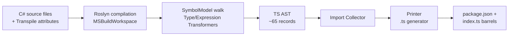

# Architecture Overview

This document explains how Metano is organized internally — the compilation
pipeline, the core projects, the extension points, and where to find things
when you want to contribute.

## High-level pipeline



**Each step:**

1. **Load** — `MSBuildWorkspace` opens the `.csproj`, runs source generators,
   produces a Roslyn `Compilation`.
2. **Discover** — `TypeTransformer.DiscoverTranspilableTypes()` walks the
   compilation for types marked with `[Transpile]` (or all public types if
   `[assembly: TranspileAssembly]` is set).
3. **Transform** — Each type goes through a specialized transformer that
   produces TS AST nodes. Expressions go through `ExpressionTransformer`
   (composed of 15+ focused handlers).
4. **Collect imports** — `ImportCollector` walks each file's AST to discover
   referenced type names and emits `import` statements.
5. **Print** — The `Printer` turns the TS AST into formatted `.ts` source.
6. **Write** — Each `TsSourceFile` is written to disk, plus auto-generated
   `index.ts` barrel files per namespace and a `package.json` with
   auto-resolved dependencies.

## Solution layout

```
src/
├── Metano/                       ← Attributes + BCL runtime mappings
│   ├── Annotations/              ← [Transpile], [Name], [StringEnum], etc.
│   └── Runtime/                  ← Declarative [MapMethod]/[MapProperty]
├── Metano.Compiler/              ← Target-agnostic core
│   ├── ITranspilerTarget.cs
│   ├── TranspilerHost.cs
│   ├── SymbolHelper.cs
│   └── Diagnostics/
├── Metano.Compiler.TypeScript/   ← TypeScript target
│   ├── TypeScriptTarget.cs
│   ├── Commands.cs
│   ├── PackageJsonWriter.cs
│   ├── Transformation/           ← 40+ transformers/handlers
│   └── TypeScript/               ← AST + Printer
└── Metano.Build/                 ← MSBuild .targets file
```

## The three-project split

Metano is split into three `.NET` assemblies with strict dependencies:

### `Metano` (assembly / NuGet: `Metano`)

The **attributes** (`[Transpile]`, `[Name]`, `[StringEnum]`, etc.) and the
**declarative BCL runtime mappings** (`[MapMethod]`, `[MapProperty]`
assembly-level attributes that define how `List<T>.Add` → `push`, etc.).

This is the **only** assembly your user code depends on — everything else is
build-time tooling.

- Target: `net8.0;net9.0;net10.0` (multi-targeted)
- No dependencies beyond netstandard BCL
- Shipped as NuGet package `Metano`

### `Metano.Compiler` (assembly / NuGet: `Metano.Compiler`)

**Target-agnostic** transpiler core. Contains:

- `ITranspilerTarget` — the interface every language target implements
- `TranspilerHost` — orchestrates load → compile → target.Transform → write
- `SymbolHelper` — Roslyn helpers shared across targets (attribute lookups,
  kebab-case conversion, name overrides, etc.)
- `MetanoDiagnostic` — the diagnostic system with codes `MS0001`–`MS0008`

A future Dart or Kotlin target would add a new project that implements
`ITranspilerTarget` and depends on `Metano.Compiler` — no changes to the core
or to `Metano`.

- Target: `net10.0`
- Depends on: `Metano`, `Microsoft.CodeAnalysis.CSharp.Workspaces`,
  `Microsoft.CodeAnalysis.Workspaces.MSBuild`
- Shipped as NuGet package `Metano.Compiler`

### `Metano.Compiler.TypeScript` (assembly / NuGet: `Metano.Compiler.TypeScript`)

The **TypeScript target**. Implements `ITranspilerTarget`, holds the TS AST
(~65 record types), the Printer, the Transformation handlers (40+ of them),
and the CLI (`metano-typescript`, built with ConsoleAppFramework).

- Target: `net10.0`, `OutputType=Exe`, `PackAsTool=true`
- Depends on: `Metano.Compiler`
- Shipped as NuGet package `Metano.Compiler.TypeScript` (installable as a
  dotnet tool: `dotnet tool install -g Metano.Compiler.TypeScript`)

### `Metano.Build` (assembly / NuGet: `Metano.Build`)

A tiny MSBuild integration package. Contains no code — just a `.targets` file
that hooks into the consumer's `dotnet build` and invokes `metano-typescript`.

- Target: `netstandard2.0` (for maximum NuGet compatibility)
- No dependencies
- Shipped as NuGet package `Metano.Build`

## The TypeScript target internals

Inside `Metano.Compiler.TypeScript/Transformation/`:

### Dispatcher

**`TypeTransformer`** is the top-level orchestrator. Its `BuildTypeStatements()`
method is a dispatch if-else chain:

```csharp
if (type.TypeKind == TypeKind.Enum)
    EnumTransformer.Transform(type, sink);
else if (type.TypeKind == TypeKind.Interface)
    InterfaceTransformer.Transform(type, sink);
else if (IsExceptionType(type))
    new ExceptionTransformer(_context!).Transform(type, sink);
else if (IsJsonSerializerContextType(type))
    new JsonSerializerContextTransformer(_context!).Transform(type, sink);
else if ((HasExportedAsModule(type) || HasExtensionMembers(type)) && type.IsStatic)
    new ModuleTransformer(_context!).Transform(type, sink);
else if (new InlineWrapperTransformer(_context!).Transform(type, sink))
    { /* handled */ }
else if (type.IsRecord || type.TypeKind is TypeKind.Struct or TypeKind.Class)
    new RecordClassTransformer(_context!).Transform(type, sink);
```

Each branch produces a list of `TsTopLevel` AST nodes.

### Type-specific transformers

- **`EnumTransformer`** — plain enums and `[StringEnum]`
- **`InterfaceTransformer`** — C# `interface` → TS `interface`
- **`ExceptionTransformer`** — anything inheriting `System.Exception` → `class extends Error`
- **`JsonSerializerContextTransformer`** — `JsonSerializerContext` → TS `SerializerContext`
- **`ModuleTransformer`** — `[ExportedAsModule]` static class → top-level functions
- **`InlineWrapperTransformer`** — struct with single primitive field → branded type + namespace
- **`RecordClassTransformer`** — the catch-all for records, structs, and classes

### Expression transformation

**`ExpressionTransformer`** is composed of 15+ focused handlers, one per
sub-grammar:

- `PatternMatchingHandler` — `is` patterns
- `SwitchHandler` — `switch` statements and expressions
- `LambdaHandler` — lambdas
- `ObjectCreationHandler` — `new`, implicit `new`, `with` expressions
- `MemberAccessHandler` — `obj.Prop` / `Type.Member`
- `InvocationHandler` — method calls (composes with `BclMapper` for BCL lowering)
- `InterpolatedStringHandler` — `$"..."` → template literals
- `OptionalChainingHandler` — `x?.Prop`
- `CollectionExpressionHandler` — C# 12 `[]` collection expressions
- `OperatorHandler` — binary operators, `is Type`
- `StatementHandler` — return, if, throw, variable declarations
- `ThrowExpressionHandler` — throw in expression position (lowered to IIFE)
- `ArgumentResolver` — named-to-positional argument resolution

Handlers compose with each other through lazy properties on the parent
`ExpressionTransformer`. Each handler covers one concern and is easy to
test/replace.

### BCL lowering

**`BclMapper`** sits in the `InvocationHandler` and lowers BCL calls. It's
driven by the **`DeclarativeMappingRegistry`**, which is built once at the
start of transformation from assembly-level `[MapMethod]` / `[MapProperty]`
attributes scanned across all referenced assemblies.

The default mappings live in `src/Metano/Runtime/`, split by area:

```
Runtime/
├── Lists.cs
├── Dictionaries.cs
├── Sets.cs
├── Queues.cs
├── Stacks.cs
├── Strings.cs
├── Math.cs
├── Console.cs
├── Guid.cs
├── Tasks.cs
├── Temporal.cs
├── Enums.cs
├── Decimal.cs
├── ImmutableCollections.cs
└── Linq.cs
```

Each file has `[assembly: MapMethod(...)]` declarations like:

```csharp
[assembly: MapMethod(typeof(List<>), nameof(List<int>.Add), JsMethod = "push")]
[assembly: MapProperty(typeof(List<>), nameof(List<int>.Count), JsProperty = "length")]
```

External packages can ship their own mappings — any referenced assembly with
`[assembly: MapMethod]` attributes is picked up automatically.

## The TS AST

`src/Metano.Compiler.TypeScript/TypeScript/AST/` contains ~65 record types
that model the TypeScript output:

- **Top level**: `TsSourceFile`, `TsClass`, `TsInterface`, `TsEnum`,
  `TsFunction`, `TsTypeAlias`, `TsImport`, `TsReExport`, `TsNamespaceDeclaration`,
  `TsTopLevelStatement`, `TsModuleExport`
- **Class members**: `TsFieldMember`, `TsGetterMember`, `TsSetterMember`,
  `TsMethodMember`, `TsConstructor`
- **Expressions**: `TsIdentifier`, `TsCallExpression`, `TsNewExpression`,
  `TsPropertyAccess`, `TsBinaryExpression`, `TsUnaryExpression`,
  `TsConditionalExpression`, `TsArrowFunction`, `TsObjectLiteral`,
  `TsArrayLiteral`, `TsStringLiteral`, `TsLiteral`, `TsTemplateLiteral`,
  `TsCastExpression`, `TsTypeReference`, `TsTemplate` (for `[Emit]` expansion)
- **Statements**: `TsReturnStatement`, `TsIfStatement`, `TsSwitchStatement`,
  `TsExpressionStatement`, `TsVariableDeclaration`, `TsThrowStatement`,
  `TsYieldStatement`
- **Types**: `TsNamedType`, `TsStringType`, `TsNumberType`, `TsBooleanType`,
  `TsArrayType`, `TsUnionType`, `TsTupleType`, `TsPromiseType`, `TsVoidType`,
  `TsAnyType`, `TsBigIntType`, `TsStringLiteralType`

### `TsTypeOrigin` — cross-package imports

`TsNamedType` carries an optional `TsTypeOrigin(PackageName, SubPath, IsDefault)`.
When the `TypeMapper` resolves a type from a referenced assembly with
`[EmitPackage]`, it populates this field. The `ImportCollector` reads the
origin directly during its AST walk and emits the cross-package import
without going through string-based name resolution.

## The Printer

`src/Metano.Compiler.TypeScript/TypeScript/Printer.cs` — takes a `TsSourceFile`
and produces formatted TypeScript source. Uses an `IndentedStringBuilder`
internally, groups class members in idiomatic order (fields → constructor →
getters/setters → methods), and handles every AST node type via a switch.

## Cyclic reference detection

`CyclicReferenceDetector` runs after all source files are produced. It builds
a directed graph of `importer → imported` edges using the generated `TsImport`
statements, then runs an iterative DFS with a `currentlyVisiting` stack to
detect back-edges. Each distinct cycle is reported once as an `MS0005`
warning.

The detector recognizes:

- `#` (root barrel import)
- `#/foo/bar` (subpath barrel import)
- `./foo` (relative file import, resolved against the importer's directory)

External imports (`metano-runtime`, `@js-temporal/polyfill`, etc.) are skipped.

## PackageJsonWriter

`src/Metano.Compiler.TypeScript/PackageJsonWriter.cs` — generates (or merges)
the `package.json` for the output directory. Reads cross-package dependencies
from `TypeMapper.UsedCrossPackages` and merges them into `dependencies`,
preserves user-written fields (name, scripts, dev deps) on re-runs, and emits
`imports` and `exports` entries aligned with the generated file layout.

## Testing

The `Metano.Tests` project uses **TUnit** on Microsoft.Testing.Platform. Tests
compile C# code inline (via `CSharpCompilation.Create`), run the transformer,
and assert on the generated TypeScript content:

```csharp
[Test]
public async Task StringEnum_GeneratesUnionType()
{
    var result = TranspileHelper.Transpile(
        """
        [Transpile, StringEnum]
        public enum Color { [Name("RED")] Red, [Name("GREEN")] Green }
        """
    );

    var expected = TranspileHelper.ReadExpected("string-enum.ts");
    await Assert.That(result["color.ts"]).IsEqualTo(expected);
}
```

The `Expected/` directory holds golden files for comparison.

For cross-package tests, `TranspileHelper.TranspileWithLibrary(libSource, consumerSource)`
compiles two assemblies (library referenced by consumer) and transpiles the
consumer, so you can test `[EmitPackage]` flow end-to-end.

## Where to add new features

| Feature type | Where |
|---|---|
| New attribute | `src/Metano/Annotations/` + handle it in the relevant transformer |
| New BCL type mapping (simple) | `src/Metano/Runtime/` with `[MapMethod]`/`[MapProperty]` |
| New BCL type mapping (complex) | `BclMapper.cs` or a new handler in `InvocationHandler` |
| New C# construct lowering | New handler in `Transformation/` + wire into `ExpressionTransformer` |
| New top-level type kind | New `XxxTransformer.cs` + wire into `TypeTransformer.BuildTypeStatements` |
| New AST node | New record in `TypeScript/AST/` + handle in `Printer.cs` |
| New language target (Dart, Kotlin, …) | New project implementing `ITranspilerTarget` |

## See also

- [CLAUDE.md](../CLAUDE.md) — day-to-day contributor guidance
- [Architecture Decision Records](adr/) — the "why" behind major design choices, including the core/target split, handler decomposition, namespace-first imports, and more
- [GitHub issues](https://github.com/danfma/metano/issues) — feature backlog and in-flight work
- [Attribute Reference](attributes.md) — user-facing view of every attribute
