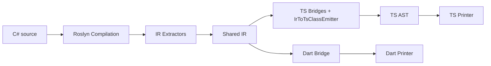

# Compiler Refactor Plan for Multi-Target Backends

## Goal

Refactor the original TypeScript-focused compiler pipeline into a target-agnostic
compiler architecture that supports multiple output languages without duplicating
semantic lowering logic. The near-term constraints are still critical:

- Keep every working target working throughout the refactor.
- Preserve observable behavior while refactoring.
- Migrate incrementally.
- Keep the architecture ready for additional targets beyond TypeScript.

---

## Current State (Snapshot)

The refactor is in-flight on branch `refactor/shared-ir`. As of the latest commits:

- **Target-agnostic core** — `Metano.Compiler` hosts the IR (`IR/*`), extractors
  (`Extraction/*`), symbol helpers, diagnostics, and the transpiler host. No
  TypeScript-specific code leaks in.
- **TypeScript target** — `Metano.Compiler.TypeScript/Bridge/` consumes the IR
  end-to-end for every covered shape: enums, interfaces, `[PlainObject]`,
  `[InlineWrapper]`, exceptions, modules, single + overloaded methods,
  single + overloaded operators, fields, properties (auto + computed +
  getter/setter), events with delegate accessors, single ctor (with super
  + DI captured params), record synthesis (equals/hashCode/with), and
  body lowering (statements + expressions). The class-shape orchestrator
  itself moved into the bridge layer as `IrToTsClassEmitter`
  (`Bridge/IrToTsClassEmitter.cs`); it walks `IrClassDeclaration.Members`
  directly and forwards each shape to its bridge — no per-member Roslyn
  lookup or symbol-keyed map left.
- **Dart/Flutter target** — `Metano.Compiler.Dart` consumes the IR end-to-end
  for the features the IR extractor currently covers (types, fields, properties,
  methods, constructors, and their bodies for the core expression/statement
  subset).
- **Test coverage** — 559 .NET tests + 102 bun tests passing across the
  three sample workspaces. Test suite runs in ~1.5s (down from ~30s) after
  [caching metadata references](#test-strategy).
- **IR pipeline is the production default.** `UseIrBodiesWhenCovered = true`.
  Uncovered bodies surface as MS0001 diagnostics (the legacy fallback
  paths are gone, so silent drops / crashes are replaced by build-time
  errors).

Pipeline reality today:

Every shape — enums, interfaces, `[PlainObject]`, `[InlineWrapper]`,
exceptions, modules, classes/records — flows through the IR bridges.
`IrToTsClassEmitter` (the renamed and relocated successor of the
old `RecordClassTransformer`) walks `IrClassDeclaration.Members`
directly and forwards each shape to its bridge; the bridges own all
emission decisions. The few remaining Roslyn touchpoints are
discovery-only (constructor list and inherited base type) — there is
no per-member symbol round trip left.

---

## Desired Target Architecture

`Roslyn front-end → semantic model extraction → shared IR → target-specific
lowering/emission`. Each layer owns its concern:

1. **Front-end.** Roslyn `Compilation`, symbols, syntax, semantic models.
2. **Common lowering.** Converts Roslyn semantics to shared IR — language-
   independent rules for records, nullable handling, async, extension methods,
   overload dispatch intent, pattern semantics, runtime helper needs.
3. **Shared IR.** Target-agnostic records for modules, types, members,
   expressions, statements, type references, runtime requirements, diagnostics.
4. **Target backends.** Convert shared IR to a target-specific AST or text.
5. **Packaging/runtime integration.** Per-target concerns (imports, package
   layout, runtime helper mapping, dependency manifest generation).

---

## Design Rules

- Do not break a working target during architectural extraction.
- Do not move TypeScript-specific syntax decisions into shared lowering.
- Do not put semantic decisions into backend printers/emitters.
- No static ambient compiler state in shared logic.
- Each refactor step must leave the codebase in a releasable state.
- Prefer adapters and parallel paths over big-bang rewrites.
- Validate every IR addition against the **anti-target-shaped checklist**:
  - Semantic names, not target names (`IrPrimitive.Guid`, never `UUID`).
  - No target-specific paths on the IR (`IrTypeOrigin` carries a logical
    `PackageId` + `Namespace`, not npm/pub subpaths).
  - No naming policy on the IR (identifiers preserve their source casing).
  - No emit flags (export policy, readonly-shorthand, etc.).
  - Semantic annotations, not syntax (`IsRecord = true` rather than "emit
    equals/hashCode/with").

---

## Phase Progress

### ✅ Phase 1 — Shared IR Type Hierarchy

Location: `src/Metano.Compiler/IR/`. Covers:

- Modules, type declarations (class/interface/enum), members (field/property/
  method/event/constructor).
- Type references (named, primitive, nullable, array, map, set, tuple, function,
  promise, generator, iterable, grouping, key-value, unknown, type parameter).
- Expressions (literals, identifiers, type references, member/element access,
  invocation, object creation, binary/unary operators, conditionals, lambdas,
  string interpolation scaffolding, throw, await, cast).
- Statements (expression, return, variable decl, if, switch, throw, foreach,
  while, do-while, try/catch, break, continue, block, yield-break).
- Semantic annotations (`IrTypeSemantics`, `IrMethodSemantics`,
  `IrPropertySemantics`) and runtime helper facts (`IrRuntimeRequirement`,
  `IrTypeOrigin`).

### ✅ Phase 2 — Remove Ambient State

- `TypeMapper` replaced its five `[ThreadStatic]` fields with an explicit
  `TypeMappingContext` threaded through every call site.
- 40+ call sites migrated; context flows through `TypeScriptTransformContext`.

### ✅ Phase 3 — Roslyn-to-IR Extractors

Location: `src/Metano.Compiler/Extraction/`. Today covers:

- `IrEnumExtractor`, `IrInterfaceExtractor` (with `[Name]` overrides,
  events, default interface methods flag).
- `IrClassExtractor` with full type header + member shape for fields,
  properties (getter/setter/initializer bodies), methods (bodies via
  `IrMethodExtractor`), events, constructors (`IrConstructorExtractor`).
- `IrExpressionExtractor` covers: literals, identifiers, type references,
  `this`/`base`, parenthesized expressions, binary + unary (prefix/postfix),
  simple + compound assignment, member/element access, invocation, explicit
  and implicit object creation, conditional (`?:`), `await`, `throw` (as
  expression), `cast`. Unknown nodes surface as `IrUnsupportedExpression`.
- `IrStatementExtractor` covers: block, expression statement, return,
  local variable declaration (with or without explicit type), `if`/`else`,
  `throw`, `foreach` (with explicit variable type), `while`, `do`/`while`,
  `try`/`catch`/`finally` (multiple catches, typed or untyped),
  `switch` (case + default labels, no patterns yet), `break`,
  `continue`. Unknown kinds surface as `IrUnsupportedStatement`.
- `IrRuntimeRequirementScanner` produces `{helper → category}` facts from any
  IR declaration or module (Guid → UUID, DateTime → Temporal, HashSet →
  HashSet, Grouping → Grouping, record → HashCode).

### ✅ Phase 4 — Adapt TypeScript Backend to Consume IR

- Enums, interfaces, and `[PlainObject]` classes flow through
  `IrToTsEnumBridge`, `IrToTsInterfaceBridge`, `IrToTsPlainObjectBridge`.
- Legacy `EnumTransformer` and `InterfaceTransformer` deleted.
- `IrToTsExpressionBridge` + `IrToTsStatementBridge` exist as infrastructure
  (validated by golden tests) but are not yet wired into the class pipeline
  — see Phase 5.10b in the outstanding work below.
- `IrBodyCoverageProbe` reports whether a given IR body is fully within the
  currently-supported subset. It is the gate the TS pipeline will use to
  decide IR vs legacy routing once Phase 6 migrations close the BCL-mapping
  and `[Emit]` gaps.
- `IrRuntimeRequirementToTsImport` converts the target-agnostic
  requirement set produced by `IrRuntimeRequirementScanner` into concrete
  `TsImport` statements (grouped by module, honoring `TypeOnly`). This is
  the TS-specific mapping table Phase 6.4 consumes.

### ✅ Phase 5 — Class/Record Extraction

- Type header, fields with initializers, properties (with bodies + semantic
  flags), methods (with bodies), constructors (with bodies), events — all
  flow through `IrClassExtractor`.
- Both the Dart target and the TypeScript target consume this end-to-end
  via their respective bridges (`IrToDartClassBridge` /
  `IrToTsClassEmitter`). No legacy class-shape transformer remains.

### ✅ Phase 6 — Runtime Requirements (plan numbering)

- `IrRuntimeRequirement` type + `IrRuntimeRequirementScanner` in place.
- TS bridge companion `IrRuntimeRequirementToTsImport` landed; backends
  consuming IR-only declarations can now short-circuit
  `ImportCollector` heuristics for runtime helpers.
- Plan's Phase 6.4 wiring (hook the collector up to the IR requirement
  set for IR-originated declarations) is still open — see outstanding
  work.

### ✅ Phase 7 — Pilot a Second Target

- Dart/Flutter prototype (`Metano.Compiler.Dart`) consuming the IR end-to-end
  for types, members, and bodies in the covered expression subset.
- Flutter consumer at `targets/flutter/sample_counter` runs the generated
  Dart against a hand-written Flutter app.
- The IR passed the "anti-target-shaped" checklist — nothing TS-specific
  leaked into the shared core.

---

## Outstanding Work

The pieces below are the remaining commitments from the original plan, grouped
by the order they should be tackled.

### ✅ Phase 5.10b — IR bodies wired into the TypeScript pipeline

`RecordClassTransformer.TransformClassMethod` now consults
`IrBodyCoverageProbe` and, when the method body is fully covered, lowers
it through `IrToTsStatementBridge` (with the declarative BCL registry
plugged in) instead of `ExpressionTransformer`. Gated by an opt-in
`TypeScriptTransformContext.UseIrBodiesWhenCovered` flag (default `false`)
so production samples keep emitting the canonical legacy output while
the IR path is exercised end-to-end by `IrBodyPipelineTests`. Flipping
the default on is a follow-up once:

- The TS IR bridge reproduces the full legacy lowering for `[Emit]`
  templates, record synthesis, and the `$add`/`$remove` delegate
  accessor pattern (items 4 and 8 below).
- The IR extractor synthesizes every implicit-`this` case the TS
  backend relies on (already handled for member/call references; watch
  for regressions on patterns extended later).

### ✅ Phase 6.4 — `ImportCollector` consumes IR runtime requirements

`TypeTransformer.TransformGroup` builds an `IrRuntimeRequirement` set
from every emitted type in the group and threads it into
`ImportCollector`, which now prepends the imports derived via
`IrRuntimeRequirementToTsImport.Convert(...)`. The legacy walker still
covers template-driven needs (`RuntimeImports`, expression-level
`Temporal.*`, runtime type checks, delegate helpers) and
`MergeImportsByPath` reconciles the overlap. Dropping the legacy walk
entirely is gated on the Phase 6 items below that still produce
template-based TS (record synthesis, JSON context).

### 🔨 Phase 6 — Migrate Complex Features (plan numbering)

Each item below is a self-contained migration. The migration order was
chosen so every step was independently shippable and so that later
items could rely on earlier ones.

1. ✅ **BCL method/property mapping via IR.** `IrMemberOrigin`
   (declaring type full name + member name + IsStatic) plumbs the
   semantic information onto `IrMemberAccess` and `IrCallExpression`.
   `DeclarativeMappingRegistry` carries full-name-keyed secondary
   indices; `IrToTsBclMapper` consumes the IR and renders lowered
   `TsExpression`s, sharing the pure rendering helpers with the legacy
   `BclMapper` via `DeclarativeMappingRendering`. Wired into
   `IrToTsExpressionBridge` behind an optional registry parameter.

2. ✅ **Pattern matching (core subset + switch expressions + property
   patterns).** `IrPattern` hierarchy plus `IrIsPatternExpression`
   covers constant, type-with-or-without designator, var, discard, and
   property patterns (`IrPropertyPattern` + `IrPropertySubpattern`,
   with optional type filter + nested pattern chain).
   `IrSwitchExpression` + `IrSwitchArm` model C#'s
   `value switch { … }` construct with optional `when` guards.
   `IrExpressionExtractor` normalizes modern `IsPatternExpressionSyntax`,
   the legacy `BinaryExpressionSyntax(IsExpression)`,
   `SwitchExpressionSyntax`, and `RecursivePatternSyntax` (property
   form only) into those IR nodes. TS bridge lowers patterns to
   `===`/`instanceof`/conjunctions of member tests, switch
   expressions to an IIFE with `if`-chain + trailing throw. Dart
   printer renders patterns as `==`/`is T`/object patterns
   (`T(member: pattern, …)`) and switch expressions natively via
   Dart 3's `switch (x) { pattern => result, … }`.
   `IrRelationalPattern` (`>` / `<` / `>=` / `<=`) and
   `IrLogicalPattern` (`and` / `or` / `not`) come from
   `RelationalPatternSyntax`, `BinaryPatternSyntax`,
   `UnaryPatternSyntax`, and `ParenthesizedPatternSyntax`. The TS
   bridge lowers them to native `x > 0`, `&&`, `||`, `!(...)`; the
   Dart printer renders them both inside boolean `is` conjunctions
   and natively inside switch-pattern arms. `IrMemberOrigin` gained
   an `IsEnumMember` flag so the TS bridge preserves the source
   PascalCase for enum members (`Status.Backlog`) instead of the
   camelCase member policy that applies to every other static
   reference. `MapSwitchExpression` now collapses into a nested
   ternary chain when the last arm is a bare discard — matching the
   legacy output byte-for-byte — and only falls back to the IIFE +
   trailing-throw when the match is non-exhaustive. Both
   `IrSwitchExpression` and `IrPropertyPattern` are now covered by
   the probe; `IrWithExpression` stays uncovered until the IR carries
   the source type's `[PlainObject]`-ness (needed to emit the spread
   literal form). `IrListPattern` and `IrPositionalPattern` cover
   `[p0, .., pN]` and `(p0, p1)` / `T(p0, p1)`; the TS bridge lowers
   list patterns into length-gated conjunctions with reverse-indexed
   tails past the slice, and positional patterns into `value[i]`
   conjunctions. Dart renders both natively inside switch arms.
   **Still follow-up:** slice sub-pattern bindings (`.. var tail`).

3. ✅ **Lambda + string interpolation.** `IrExpressionExtractor` now
   emits `IrLambdaExpression` (simple and parenthesized lambdas, with
   explicit or inferred parameter types) and `IrStringInterpolation`
   (text + expression parts, optional format specifiers). TS bridge
   renders as `TsArrowFunction` / `TsTemplateLiteral`; Dart printer as
   `(params) => body` / `'${expr}'` with proper escaping.

4. ✅ **Record synthesis (Dart side).** `IrToDartClassBridge` now
   synthesizes `operator ==`, `hashCode` (via `Object.hash`), and a
   fully-functional `copyWith` for record-shaped classes
   (`IsRecord && !IsPlainObject`) directly from the IR. Bodies are
   built as IR expression trees (`IrIsPatternExpression`,
   `IrBinaryExpression`, `IrCallExpression`) so the existing
   `IrBodyPrinter` renders them without bridge-specific string
   templating. `DartParameter` gained `IsNamed` + `IsRequired` flags
   and the printer splits parameters into the three Dart regions
   (required positional, `[…]` optional, `{…}` named). `copyWith`
   emits every field as `{Type? name}` and falls back to
   `name ?? this.name` in the body. `==` and `hashCode` are tagged
   with `@override`. **Still follow-up (TS):** the `RecordSynthesizer`
   retired in favor of `IrToTsRecordSynthesisBridge` — nothing left
   to migrate on the TS side. **Still follow-up (Dart):** the
   `copyWith` signature currently cannot distinguish "not supplied"
   from "supplied null" for already-nullable fields; the C# `with`
   has the same semantics, so deferred.

5. ✅ **Operator overload bodies.** `DartMethodSignature.OperatorSymbol`
   + `IrToDartClassBridge.MapOperatorToDart` render user-defined
   operators as Dart `operator +`/`==`/… syntax. TS keeps legacy
   emission (no regression).

6. ✅ **Extension methods / module lowering (Dart side).**
   `IrModuleFunctionExtractor` walks ordinary public methods of a
   static class into `IrModuleFunction` entries; `IrToDartModuleBridge`
   renders them as flat top-level Dart functions. `DartTransformer`
   routes `[ExportedAsModule]` static classes through that pipeline
   instead of the class bridge. **Still follow-up:** classic
   extension methods (first parameter tagged `this`), C# 14
   `extension(R r) { ... }` blocks, and `[ModuleEntryPoint]`. TS
   keeps the legacy `ModuleTransformer` — migrating it requires
   covering those three forms first.

7. ✅ **Overload dispatcher.** `IrMethodDeclaration.Overloads` is
   consumed on the Dart side: `DartTransformer.ReportOverloadDiagnostics`
   surfaces a warning pointing at `[Name]` rename or optional
   parameters when a method has overloads (Dart has no method
   overloading). **Still follow-up:** TS bridge consuming `Overloads`
   to emit the dispatcher from IR — the legacy
   `OverloadDispatcherBuilder` keeps doing that today.

8. ⏭ **JSON serializer context — scoped target-specific.** The TS
   `JsonSerializerContextTransformer` (~640 lines) emits a
   `SerializerContext` subclass with pre-computed `TypeSpec` maps
   wired to the `metano-runtime/system/json` helpers. That output
   shape is fundamentally TS-runtime-coupled: there is no
   target-agnostic "JSON metadata on a type" that translates outside
   TypeScript because the Dart target uses separate serialization
   idioms (`dart:convert`, `json_serializable`, etc.) with no
   analogue to the compile-time context. Migrating the feature to IR
   would duplicate the TS shape under IR type names without semantic
   gain, so the legacy transformer stays put. If/when a second target
   grows compile-time JSON support, we revisit.

### ✅ Phase 6 wrap-up — IR pipeline is production-default

All three prerequisites for flipping `UseIrBodiesWhenCovered = true`
landed, the flag was flipped, and every regenerated sample
(SampleTodo, SampleIssueTracker, SampleTodo.Service,
SampleOperatorOverloading, SampleCounter) reproduces the legacy output
byte-for-byte. The bridges and the extractor-side rewrites that got
us here:

- **Record synthesis** — `IrToTsRecordSynthesisBridge` replaces
  `RecordSynthesizer`. `RecordClassTransformer.LowerMethodBody`
  routes through it. `RecordSynthesizer.cs` is deleted.
- **Module lowering (function path)** — `IrToTsModuleBridge`
  handles `[ExportedAsModule]` static methods and classic extension
  methods, with generics, `[Name]` overrides, and iterator
  (`function*`) semantics preserved.
- **Overload dispatcher (method path)** —
  `IrToTsOverloadDispatcherBridge` consumes
  `IrMethodDeclaration.Overloads` + `IrTypeCheckBuilder` for runtime
  guards, matching the legacy numeric / Temporal / decimal
  dispatch rules and carrying type parameters onto fast paths.
- **Extractor-side numeric normalization** — Decimal binary ops
  (`a + b` → `a.plus(b)`), Decimal/BigInteger literals in converted
  contexts, numeric casts (`(decimal)bigInt`, `(BigInteger)decimal`,
  `(int)decimal`, …), and `Math.Round(decimal)` all rewrite at
  extraction time, so no BCL mapping reaches the bridge stage.
- **Effective-const inference** — `IrStatementExtractor` promotes
  `var`-declared locals that are never reassigned to
  `IsConst = true`, matching the legacy `let`/`const` policy.

### ✅ Phase 6 item 7 — TS overload dispatcher via IR

`RecordClassTransformer.TryBuildOverloadDispatcherFromIr` now routes
every overload group whose bodies pass `IrBodyCoverageProbe` through
`IrToTsOverloadDispatcherBridge`; uncovered groups (containing
`[Emit]` templates / unsupported shapes) still fall back to the
legacy `OverloadDispatcherBuilder`. The prerequisites that landed to
unblock this switch:

- `IrNamedTypeRef.Semantics` carries the type's kind (class, record,
  interface, string/numeric enum, inline wrapper, exception) plus
  string-enum values, inline-wrapper primitive, and a transpilable
  flag. `IrTypeCheckBuilder` consumes these to emit the right runtime
  guard for every parameter kind (`=== "x" || …`, `isInt32`,
  `typeof === "object"`, typeof-of-underlying, `instanceof`).
- `IrArgument(Value, Name?)` preserves named-argument syntax through
  the IR pipeline. Dart renders named arguments natively; the
  extractor normalizes mixed positional + named calls into strict
  positional order (filling skipped defaults from the C# parameter
  defaults, including enum members) so TS lowering stays byte-for-byte
  identical to the legacy output.
- `IrToTsExpressionBridge.MapNewExpression` maps
  `new InvalidOperationException(msg)` (and any other non-transpilable
  `System.Exception` subtype) to `new Error(msg)`, matching the legacy
  `ObjectCreationHandler` fallback.

Legacy `OverloadDispatcherBuilder.BuildMethod` is no longer called on
any sample that fits the covered IR subset. `BuildConstructor` is
still used (constructor-level overload dispatch hasn't been modeled
in the IR yet) — that's the remaining blocker for retiring the file.

### ✅ Phase 6 item 7 prerequisite — `IrNamedTypeRef` carries semantic kind

`IrNamedTypeRef.Semantics` now carries an `IrNamedTypeSemantics`
(kind + string-enum values + inline-wrapper primitive + transpilable
flag). `IrTypeRefMapper.BuildNamedTypeSemantics` fills it at extraction
time so backends don't have to rediscover the information from Roslyn.
`IrTypeCheckBuilder` consumes the new metadata to emit the same runtime
guards the legacy `TypeCheckGenerator` does — exhaustive value checks
for `[StringEnum]`, `isInt32` for numeric enums, `typeof === "object"`
for interfaces, `typeof === "string"|"number"|…` for inline wrappers,
and `instanceof` only for runtime-backed classes / records / structs.
Dispatcher wiring into production (`RecordClassTransformer.BuildMethod`
routing through `IrToTsOverloadDispatcherBridge`) still blocks on IR
extractor preserving named arguments and on the expression bridge
matching the legacy exception lowering (`throw new InvalidOperationException`
→ `throw new Error`). The bridge itself is now covered for every kind
of runtime test.

### ✅ Retired legacy TS transformers (deleted from the tree)

These files used to host the TS-only lowering before each shape moved
to a dedicated IR bridge:

- `EnumTransformer` → `IrToTsEnumBridge`
- `InterfaceTransformer` → `IrToTsInterfaceBridge`
- `RecordSynthesizer` → `IrToTsRecordSynthesisBridge`
- `TypeCheckGenerator` → `IrTypeCheckBuilder`
- `BclMapper` (legacy expression rewrites) → `IrToTsBclMapper`
- `ExpressionTransformer` + 13 child handlers → `IrToTsExpressionBridge`
  + `IrToTsStatementBridge`
- `OverloadDispatcherBuilder` → `IrToTsOverloadDispatcherBridge` +
  `IrToTsConstructorDispatcherBridge`
- `ObjectCreationHandler` → folded into `IrToTsExpressionBridge` via
  `IrNewExpression` + `IrNamedTypeRef.Semantics.Kind`
- `ModuleTransformer` → `IrToTsModuleBridge` (top-level statements +
  C# 14 extension blocks moved into `IrModuleFunctionExtractor` +
  `TypeTransformer.EmitTopLevelStatements`)
- `ExceptionTransformer` → `IrToTsExceptionBridge`
- `InlineWrapperTransformer` → `IrToTsInlineWrapperBridge`

### ✅ Phase B — `RecordClassTransformer` retirement

Done. The legacy file is gone — its content was renamed to
`IrToTsClassEmitter` and relocated to
`src/Metano.Compiler.TypeScript/Bridge/IrToTsClassEmitter.cs`. The
emitter walks `IrClassDeclaration.Members` directly, defers operators
and methods so legacy "operators before methods" ordering survives, and
forwards each shape to its bridge (`IrToTsClassBridge`,
`IrToTsRecordSynthesisBridge`, `IrToTsConstructorDispatcherBridge`,
`IrToTsOverloadDispatcherBridge`). The bridges still own every
emission decision; the emitter just orchestrates discovery + IR walk
+ bridge dispatch.

**Migrated to `IrToTsClassBridge`** (each entry erased a helper /
sub-pipeline from the legacy file along the way):

- Shape: `BuildExtends`, `BuildImplements`, `BuildTypeParameters`
- Defaults: `ComputeDefaultInitializer` (consumes
  `IrNamedTypeSemantics.EnumDefaultMember`)
- Members: `BuildField`, `BuildProperty`, `BuildMethod`, `BuildEvent`,
  `BuildOperator`, `BuildOperatorDispatcher`
- Constructor: `BuildSimpleConstructor`, `BuildPromotedCtorParams`,
  `BuildCapturedCtorParams`
- Helpers: `MapAccessibility`, `MapOperatorKindToName`

**IR additions that unblocked the retirement:**

- `IrConstructorParameter.CapturedFieldName` + `IrFieldDeclaration.IsCapturedByCtor`
  — paired DI-capture annotation populated by `IrClassExtractor.AnnotateCapturedParams`.
- `IrConstructorParameter.PromotedVisibility` + `EmittedName` — the
  promoted property's accessibility and `[Name]` override surface on
  the parameter so backends don't reach back to Roslyn for them.
- `IrNamedTypeSemantics.EnumDefaultMember` — `default(E)` resolves
  without requiring a member walk on the referencing type.
- `IrTypeRefSignatures` — structural signature for matching same-arity
  operator overloads against their IR entries.
- `IrMethodSemantics.IsEmitTemplate` + `IrClassExtractor` filtering —
  `[Emit]` templates no longer surface as IR class members, so the
  orchestrator can iterate `ir.Members` without re-checking Roslyn
  for inline-template flags.
- `IrToTsTypeMapper` accepting an `IrToTsTypeOverrides` resolver —
  `BclExportTypeOverrides` carries `[ExportFromBcl]` mappings
  (decimal → Decimal from `decimal.js`, etc.) on the IR-mapping path
  and tracks per-package usage in `TypeMappingContext.UsedCrossPackages`.
  Eliminated the last legacy `TypeMapper.Map` consumer and let the
  whole legacy `TypeMapper.cs` (363 lines) be deleted.

**What still lives in the emitter** (small, Roslyn-coupled discovery —
not blocking and not legacy lowering):

- `Transform` discovery of explicit constructors and the inherited
  base-type via `type.Constructors` / `type.BaseType.OriginalDefinition`.
  The IR doesn't yet expose either as a target-agnostic shape.
- `IsConstructorParam` / `HasUnmatchedExplicitConstructor` — tiny
  shape predicates over the same Roslyn discovery results.
- `ResolveCtorParamTsType`, `ResolveSuperArgs`,
  `EmitUnsupportedConstructor`, `ReportUnsupportedInBody`,
  `LowerMethodSignature` (with `PromoteClassTypeParamsForStatic` so
  static helpers on a generic class still declare the type params they
  reference — TS2302 guard).
- `TryBuildConstructorDispatcherFromIr` /
  `TryBuildOverloadDispatcherFromIr` — IR-only thin wrappers that
  body-coverage-probe overload groups and forward to the dispatcher
  bridges; they no longer re-extract any IR.

### 🔨 What still keeps the remaining legacy TS pieces alive

- `JsonSerializerContextTransformer` — scoped target-specific (see
  Phase 6 item 8). Its type-mapping calls already route through the
  IR mapper + `BclExportTypeOverrides` (so it no longer holds the
  legacy `TypeMapper` alive); the *output shape* — a runtime
  `SerializerContext` keyed to `metano-runtime/system/json` helpers —
  is fundamentally TS-runtime-coupled and won't translate to other
  targets. Migrating it would only rename Roslyn calls without
  semantic gain. Stays put until a second target grows compile-time
  JSON support.
- `ImportCollector` legacy walker — Phase 6.4 hoisted IR runtime
  requirements ahead of it; the walker is now a defensive fallback
  for template-driven `RuntimeImports`, expression-body `Enumerable`
  / `Grouping` annotations, and `UUID` references inside
  `JsonSerializerContextTransformer`-emitted bodies. Drops once
  those last cases route through IR.

Each follow-up is a focused diff. None are blocking: the IR pipeline
is the production path for every covered body and uncovered shapes
surface as MS0001 diagnostics rather than silent drops or crashes.

---

## Test Strategy

### Keep Existing Tests

All existing behavior tests remain required. Every commit in this branch
keeps the full suite green — currently 559 .NET (TUnit) tests plus 102
bun tests across the three sample workspaces (`sample-todo`,
`sample-issue-tracker`, `sample-todo-service`). Regeneration of
generated `.ts` under `targets/js/*` is part of the CI signal: divergence
in any generated file would surface as a failing bun test.

The test suite used to scan the runtime directory and construct ~200
`MetadataReference`s per test (450+ tests × ~200 loads → ~100k metadata
loads per run) — costly in memory and wall clock. The helpers now share
a single process-wide cached list (`TranspileHelper.BaseReferences`),
which cut the suite from ~30s to ~1.5s on a local run.

### Layered Tests

The refactor adds tests at three complementary levels:

1. **Roslyn → IR** — `tests/Metano.Tests/IR/Ir*ExtractionTests.cs` exercise
   the extractors in isolation. They compile a C# snippet, run the
   extractor, and assert the IR shape. They do not depend on any backend.
2. **IR → target AST** — `IrToTsBodyBridgeTests`, `IrToTsBridgeGoldenTests`,
   and analogous Dart golden files print the target output from a
   hand-built IR or from IR produced by the Roslyn path, then compare
   against expected strings. Failures here signal bridge regressions
   without touching the front end.
3. **End-to-end** — the original transpile tests and the bun suites
   under `targets/js/*` validate the full path. They are authoritative
   for behavior.

### Feature Matrix Coverage

Per feature, track:

- Semantic representation in IR (is it in the model, and in which extractor?)
- TypeScript backend support (IR path, legacy path, or both)
- Dart backend support (IR path only — there is no Dart legacy)
- Runtime helper dependency
- Expected diagnostics

This matrix lives implicitly in the Phase 6 checklist above; each item
there identifies where in the matrix a given C# construct stands today.

---

## Future refactors (parked)

### Pattern-match conditionals → guard helpers

Pattern tests currently lower as inline boolean expressions —
`value instanceof T && value.a === 0 && …`. When the pattern carries
bindings (`Point { X: var x }`), the condition would grow more complex
and/or require an IIFE to reach the binding. An alternative shape,
cleaner to read and easier to optimize in JS engines, is to emit
`isXxx(value)` guard functions (and a `TryGetXxx(value, out var ...)`
companion when bindings need to escape). This would:

- Replace long inline conjunctions with named predicates.
- Give binding patterns a natural home (the helper returns the bound
  values as an object or via an out-parameter style).
- Make the generated TS easier to debug and inline.

Parked as a post-Phase-6 refactor — blocks nothing today but is worth
revisiting once pattern-match coverage stabilizes.

## Risks

### Big-bang rewrite

Mitigation: the refactor shipped in small, parallel-path commits.
Each migration in Phase 6 replaced a single slice and left the rest
of the pipeline untouched. No commit in this branch ever required
coordinated changes across more than a handful of files; legacy
handlers stayed live until their IR replacements were proven byte-
identical against the full sample suites.

### IR becomes TypeScript-shaped

Mitigation: the anti-target-shaped checklist (section "Design Rules")
is applied at every IR addition. Phase 7 (Dart target) has been the
primary forcing function so far — every time the IR had a TS bias, the
Dart bridge surfaced it. Concrete cases addressed: `IrTypeOrigin` no
longer carries subpaths (the Dart bridge builds its own), `IrPrimitive`
names are semantic (`Guid`, not `UUID`), `IrTypeReference` was added to
separate type references from ordinary identifiers so each backend can
preserve or normalize casing per its own convention.

### Semantic duplication during migration

Mitigation: once a feature is migrated through IR, the legacy path is
retired **immediately** in the same PR (see Phase 4 — `EnumTransformer`
and `InterfaceTransformer` were deleted the same moment the IR bridges
were wired). The parallel-path window exists only within a single
commit, never between commits.

### Test suite only validates TypeScript text

Mitigation: IR-level tests live in `tests/Metano.Tests/IR/` and are
independent of any target. They catch IR regressions that would be
invisible to a TS-only suite. Phase 7 (Dart target) adds a second
observation point: any IR change that breaks target-agnostic
assumptions shows up in the Dart output even if TS stays identical.

---

## Source-agnostic future (context only — not in scope)

The IR is already source-agnostic (no Roslyn references in `Metano.Compiler.IR/*`
or in the target bridges). Introducing a second front-end (a hand-written
parser for a Metano-native language, for example) would require:

- Splitting `Metano.Compiler.Frontend.CSharp/` out of the core as a separate
  project (mostly `git mv` + reference updates).
- Introducing an `IrCompilation` carrier + `ISourceFrontend` interface so
  `ITranspilerTarget.Transform` stops taking a Roslyn `Compilation` directly.

That refactor is intentionally deferred — it's small, it's not blocking any
current target, and it's best done when there's a real second front-end.

---

## Suggested Prompting Guidance for Follow-up Agents

- Preserve behavior first. Every commit lands with all tests green.
- Prefer adapters + parallel paths over big-bang rewrites.
- When you extract a semantic rule to the IR, cross-check the anti-target-
  shaped checklist before declaring the addition complete.
- When you wire an IR-driven path, keep the legacy fallback until the IR
  covers every test-visible behavior.
- After every non-trivial change, run `dotnet run --project tests/Metano.Tests/`
  and the bun test suites in `targets/js/*`.
