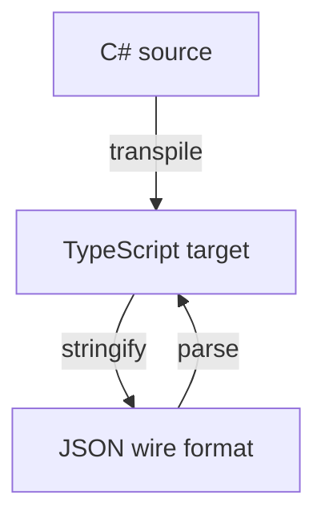

# JSON Serialization

Metano transpiles `System.Text.Json.Serialization.JsonSerializerContext`
subclasses into a TypeScript `SerializerContext` with **pre-computed `TypeSpec`
definitions**. JSON property names, naming policies, and per-property overrides
are all resolved at **compile time** — no runtime reflection, no string
comparisons.

## The triangle

There are three representations of your data, and each transition has its own
rules:



Naming conventions differ at each layer:

| Layer | Default naming | Example |
|-------|---------------|---------|
| C# property | PascalCase | `FirstName` |
| JSON wire | depends on `JsonSourceGenerationOptions.PropertyNamingPolicy` | `firstName`, `first_name`, `FirstName` |
| TypeScript field | camelCase (Metano convention) | `firstName` |

The TypeScript `toJSON()` and `fromJSON()` maps **TS field ↔ JSON wire** — C#
is the source of truth for deriving both, but they don't know about each other.

## Minimal example

**Input** — `JsonContext.cs`:

```csharp
using System.Text.Json.Serialization;
using Metano.Annotations;

namespace TestApp;

[StringEnum]
public enum Priority
{
    Low,
    Medium,
    High,
}

public record TodoItem(string Title, bool Completed, Priority Priority);

[Transpile]
[JsonSourceGenerationOptions(PropertyNamingPolicy = JsonKnownNamingPolicy.SnakeCaseLower)]
[JsonSerializable(typeof(TodoItem))]
public partial class JsonContext : JsonSerializerContext;
```

**Output** — `json-context.ts`:

```typescript
import { SerializerContext, type TypeSpec } from "metano-runtime/system/json";
import { TodoItem } from "./todo-item";
import { Priority } from "./priority";

export class JsonContext extends SerializerContext {
  private static readonly _default: JsonContext = new JsonContext();
  static get default(): JsonContext { return this._default; }

  private _todoItem?: TypeSpec<TodoItem>;
  get todoItem(): TypeSpec<TodoItem> {
    return this._todoItem ??= this.createSpec({
      type: TodoItem,
      factory: (p) => new TodoItem(
        p.title as string,
        p.completed as boolean,
        p.priority as Priority,
      ),
      properties: [
        { ts: "title",    json: "title",    type: { kind: "primitive" } },
        { ts: "completed", json: "completed", type: { kind: "primitive" } },
        { ts: "priority",  json: "priority",  type: { kind: "enum", values: Priority } },
      ],
    });
  }
}
```

**Usage** from TS:

```typescript
import { JsonSerializer } from "metano-runtime/system/json";
import { JsonContext } from "./json-context";
import { TodoItem } from "./todo-item";

const todo = new TodoItem("Write docs", false, "high");

// TS → JSON
const wire = JsonSerializer.serialize(todo, JsonContext.default.todoItem);
// → { title: "Write docs", completed: false, priority: "high" }

// JSON → TS
const parsed = JsonSerializer.deserialize(wire, JsonContext.default.todoItem);
// → TodoItem { title: "Write docs", completed: false, priority: "high" }
```

## What the transpiler does

When it sees a class that inherits from `JsonSerializerContext`:

1. **Reads `[JsonSourceGenerationOptions]`** — resolves the naming policy
   (`CamelCase`, `SnakeCaseLower`, `SnakeCaseUpper`, `KebabCaseLower`,
   `KebabCaseUpper`, or `null`/default for PascalCase preservation).

2. **Collects `[JsonSerializable(typeof(T))]` attributes** — each `T` becomes a
   lazy getter on the context class.

3. **For each serializable type `T`**, walks its public properties and:
   - Excludes `[JsonIgnore]` properties
   - Resolves the JSON name: `[JsonPropertyName]` override wins, otherwise
     applies the context's naming policy to the C# property name
   - Classifies the property type (primitive, temporal, decimal, array, map,
     branded, enum, ref, etc.)

4. **Emits a `TypeSpec<T>`** as a lazy getter on the `SerializerContext`
   subclass, with pre-computed `ts`/`json` names.

## Supported type descriptors

The runtime (`metano-runtime/system/json`) interprets `TypeSpec` objects and
handles these kinds:

| Kind | TS type | On serialize | On deserialize |
|------|---------|-------------|----------------|
| `primitive` | string, number, boolean | passthrough | passthrough |
| `temporal` | `Temporal.PlainDate`, etc. | `.toString()` | `Type.from(iso)` |
| `decimal` | `Decimal` | `.toNumber()` (or string via custom converter) | factory wraps `new Decimal(...)` |
| `array` | `T[]` | `.map(serialize)` | `.map(deserialize)` |
| `map` | `Map<K,V>` | `Object.fromEntries(...)` | `new Map(Object.entries(...))` |
| `hashSet` | `HashSet<T>` | `[...set]` | `new HashSet(arr)` |
| `branded` | `[InlineWrapper]` type | passthrough (brand erases at runtime) | `Type.create(value)` |
| `enum` | string enum | passthrough (already string) | validates against allowed values |
| `numericEnum` | numeric enum | passthrough | validates against allowed values |
| `nullable` | `T \| null` | `null` passes through, else recurse | same |
| `ref` | another spec | recursive `serialize` with target spec | recursive `deserialize` |

## Attribute support

| C# attribute | Handled by Metano? | Effect |
|---|---|---|
| `[JsonSerializable(typeof(T))]` | ✅ | Adds `T` to the context's type list |
| `[JsonSourceGenerationOptions]` with `PropertyNamingPolicy` | ✅ | Applies the naming policy to all properties |
| `[JsonPropertyName("wire_name")]` | ✅ | Overrides the wire name for that property |
| `[JsonIgnore]` | ✅ | Excludes the property from the spec |
| `JsonKnownNamingPolicy.CamelCase` | ✅ | `FirstName` → `firstName` |
| `JsonKnownNamingPolicy.SnakeCaseLower` | ✅ | `FirstName` → `first_name` |
| `JsonKnownNamingPolicy.SnakeCaseUpper` | ✅ | `FirstName` → `FIRST_NAME` |
| `JsonKnownNamingPolicy.KebabCaseLower` | ✅ | `FirstName` → `first-name` |
| `JsonKnownNamingPolicy.KebabCaseUpper` | ✅ | `FirstName` → `FIRST-NAME` |
| Default (`null`) | ✅ | Preserves PascalCase (`FirstName` → `FirstName`) |
| `[JsonConverter]` | ❌ | Not yet — use custom converters at runtime instead |
| `[JsonRequired]` | ❌ | Not yet |
| `[JsonExtensionData]` | ❌ | Not yet |
| Polymorphic `[JsonDerivedType]` | ❌ | Not yet |

## Custom converters

The runtime `SerializerContext` accepts custom converters in its options:

```typescript
import { SerializerContext, type JsonConverter } from "metano-runtime/system/json";
import { Decimal } from "decimal.js";

const decimalAsString: JsonConverter = {
  kind: "decimal",
  serialize: (v) => (v as Decimal).toString(),
  deserialize: (v) => new Decimal(v as string),
};

// If you construct your context manually:
class MyContext extends SerializerContext {
  constructor() {
    super({ converters: [decimalAsString] });
  }
}
```

The default `decimal` converter uses `.toNumber()`, which can lose precision for
large/high-precision values. Use the custom converter above to serialize as
strings for safety.

## Inheritance

When a record extends another transpilable record, the child's `TypeSpec`
references the parent's spec via a `base` field:

```typescript
get dog(): TypeSpec<Dog> {
  return this._dog ??= this.createSpec({
    type: Dog,
    base: this.animal,  // ← inherits name and legs from animal's spec
    factory: (p) => new Dog(
      p.name as string,
      p.legs as number,
      p.breed as string,
    ),
    properties: [
      { ts: "breed", json: "breed", type: { kind: "primitive" } },
    ],
  });
}
```

At serialize/deserialize time, the runtime walks the `base` chain and collects
all inherited properties before processing own properties.

## When to use `[PlainObject]` vs `JsonSerializerContext`

Both are valid ways to handle JSON data:

| `[PlainObject]` | `JsonSerializerContext` |
|---|---|
| Emits a TS `interface`, no class | Emits a full class with spec-driven serialization |
| Use `JSON.stringify`/`parse` directly | Use `JsonSerializer.serialize`/`deserialize` |
| No naming policy handling | Full naming policy + per-property overrides |
| No nested type conversion | Handles `Temporal`, `Decimal`, `Map`, `HashSet`, branded types, etc. |
| Fast path for simple DTOs | Correct handling of non-JSON-safe types |

**Rule of thumb:**

- **Simple DTO** with only primitives and arrays of primitives? → `[PlainObject]`
- **Rich domain type** with dates, decimals, branded IDs, maps? → `JsonSerializerContext`

## See also

- [Attribute Reference](attributes.md#PlainObject) — `[PlainObject]` details
- [BCL Type Mappings](bcl-mappings.md) — how types are classified
- [specs/serialization-plan.md](../specs/serialization-plan.md) — the original design doc
