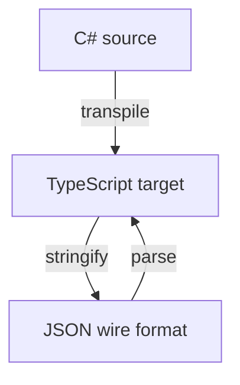

# JSON Serialization

Metano transpiles `System.Text.Json.Serialization.JsonSerializerContext`
subclasses into a TypeScript `SerializerContext` with **pre-computed `TypeSpec`
definitions**. JSON property names, naming policies, and per-property overrides
are all resolved at **compile time** — no runtime reflection, no string
comparisons.

## The triangle

There are three representations of your data, and each transition has its own
rules:


```mermaid
flowchart TD
    CS[C# source]
    TS[TypeScript target]
    JSON[JSON wire format]

    CS -->|transpile| TS
    TS -->|stringify| JSON
    JSON -->|parse| TS
```

Naming conventions differ at each layer:

| Layer | Default naming | Example |
|-------|---------------|---------|
| C# property | PascalCase | `FirstName` |
| JSON wire | depends on `JsonSourceGenerationOptions` (`PropertyNamingPolicy`, or camelCase under `JsonSerializerDefaults.Web`) | `firstName`, `first_name`, `FirstName` |
| TypeScript field | camelCase (Metano convention) | `firstName` |

The TypeScript `toJSON()` and `fromJSON()` maps **TS field ↔ JSON wire** — C#
is the source of truth for deriving both, but they don't know about each other.

## Minimal example

**Input** — `JsonContext.cs`:

```csharp
using System.Text.Json.Serialization;
using Metano.Annotations;

namespace TestApp;

[StringEnum]
public enum Priority
{
    Low,
    Medium,
    High,
}

public record TodoItem(string Title, bool Completed, Priority Priority);

[Transpile]
[JsonSourceGenerationOptions(PropertyNamingPolicy = JsonKnownNamingPolicy.SnakeCaseLower)]
[JsonSerializable(typeof(TodoItem))]
public partial class JsonContext : JsonSerializerContext;
```

**Output** — `json-context.ts`:

```typescript
import { SerializerContext, type TypeSpec } from "metano-runtime/system/json";
import { TodoItem } from "./todo-item";
import { Priority } from "./priority";

export class JsonContext extends SerializerContext {
  private static readonly _default: JsonContext = new JsonContext();
  static get default(): JsonContext { return this._default; }

  private _todoItem?: TypeSpec<TodoItem>;
  get todoItem(): TypeSpec<TodoItem> {
    return this._todoItem ??= this.createSpec({
      type: TodoItem,
      factory: (p) => new TodoItem(
        p.title as string,
        p.completed as boolean,
        p.priority as Priority,
      ),
      properties: [
        { ts: "title",    json: "title",    type: { kind: "primitive" } },
        { ts: "completed", json: "completed", type: { kind: "primitive" } },
        { ts: "priority",  json: "priority",  type: { kind: "enum", values: Priority } },
      ],
    });
  }
}
```

**Usage** from TS:

```typescript
import { JsonSerializer } from "metano-runtime/system/json";
import { JsonContext } from "./json-context";
import { TodoItem } from "./todo-item";

const todo = new TodoItem("Write docs", false, "high");

// TS → JSON
const wire = JsonSerializer.serialize(todo, JsonContext.default.todoItem);
// → { title: "Write docs", completed: false, priority: "high" }

// JSON → TS
const parsed = JsonSerializer.deserialize(wire, JsonContext.default.todoItem);
// → TodoItem { title: "Write docs", completed: false, priority: "high" }

// JSON text → TS, as STJ's Deserialize(string): decimals keep every digit
const fromText = JsonSerializer.deserializeText(
  JSON.stringify(wire),
  JsonContext.default.todoItem,
);
```

`deserialize` takes the tree `JSON.parse` built; `deserializeText` takes the
JSON text, reads each `decimal` from its exact digits and throws .NET's
`JsonException` messages for invalid text ([details](#exact-reads)).

## What the transpiler does

When it sees a class that inherits from `JsonSerializerContext`:

1. **Reads `[JsonSourceGenerationOptions]`** — resolves the naming policy
   (`CamelCase`, `SnakeCaseLower`, `SnakeCaseUpper`, `KebabCaseLower`,
   `KebabCaseUpper`, or `null`/default for PascalCase preservation). The
   `JsonSerializerDefaults.Web` constructor argument selects `CamelCase`, and a
   named `PropertyNamingPolicy` overrides it (see [Web defaults](#web-defaults)).

2. **Collects `[JsonSerializable(typeof(T))]` attributes** — each `T` becomes a
   lazy getter on the context class (see [Roots](#roots) for the accepted
   types, the getter names and the diagnostics).

3. **Adds every object type reachable from those roots**, as System.Text.Json
   does: types reached through property types, array / list / set elements,
   dictionary keys and values, nullable underlying types, and base types each
   get their own getter, so every `ref` descriptor and `base` link resolves.
   Roots come first, in declaration order, followed by the discovered types in
   breadth-first order; each type is emitted once, and cycles (`A → B → A`)
   terminate. The element, dictionary value and nullable inner types of a
   collection root are discovered the same way, so `typeof(ShotTiming[])`
   also emits `shotTiming`. Classes and structs are discovered when they are
   transpiled in their declaring assembly: this project (nested ones
   included) or a referenced `[TranspileAssembly]` + `[EmitPackage]` library,
   whose types the context imports from the package (and adds to
   `package.json#dependencies`). Closed generic types are discovered under
   their constructed name (`Page<EpisodeSummary>` → `pageEpisodeSummary`, with
   `TypeSpec<Page<EpisodeSummary>>`). Interfaces are not discovered. Base
   types, including a base declared in a referenced library, are included
   whenever the spec links to them through `base`. Every type registered with
   `[JsonDerivedType]` by a polymorphic base the context dispatches through (a
   root, a property / element / value type, or a registered type) is added
   too, in attribute order, with its own base chain and property types, even
   when no root names it (see [Polymorphism](#polymorphism)).

4. **For each serializable type `T`**, walks its public properties and:
   - Excludes `[JsonIgnore]` and static properties
   - Resolves the JSON name: `[JsonPropertyName]` override wins, otherwise
     applies the context's naming policy to the C# property name
   - Classifies the property type (primitive, temporal, decimal, array, map,
     branded, enum, ref, etc.)

5. **Emits a `TypeSpec<T>`** as a lazy getter on the `SerializerContext`
   subclass, with pre-computed `ts`/`json` names, for every object type, and a
   **`ValueSpec<T>`** for every other root.

## Roots

`[JsonSerializable]` accepts the same root types as System.Text.Json:

| Root | Getter | Spec |
|------|--------|------|
| `typeof(EpisodeSummary)` (a transpiled class, record or struct) | `episodeSummary` | `TypeSpec<EpisodeSummary>` |
| `typeof(IReadOnlyList<EpisodeSummary>)` | `iReadOnlyListEpisodeSummary` | `ValueSpec<EpisodeSummary[] \| null>` |
| `typeof(EpisodeSummary[])` | `episodeSummaryArray` | `ValueSpec<EpisodeSummary[] \| null>` |
| `typeof(IEnumerable<Leaf>)` | `iEnumerableLeaf` | `ValueSpec<Iterable<Leaf> \| null>` |
| `typeof(Dictionary<string, EpisodeSummary>)` | `dictionaryStringEpisodeSummary` | `ValueSpec<Map<string, EpisodeSummary> \| null>` |
| `typeof(HashSet<string>)` | `hashSetString` | `ValueSpec<HashSet<string> \| null>` |
| `typeof(string)`, `typeof(int)`, `typeof(int?)` | `string`, `int32`, `nullableInt32` | `ValueSpec<string \| null>`, `ValueSpec<number>`, `ValueSpec<number \| null>` |
| `typeof(Guid)`, a `[StringEnum]`, a `[Branded]` type | `guid`, the type's name | `ValueSpec<UUID>`, `ValueSpec<Mood>`, `ValueSpec<EpisodeId>` |
| `typeof(List<string>), TypeInfoPropertyName = "Names"` | `names` | `ValueSpec<string[] \| null>` |

A `ValueSpec` holds the same descriptor the type gets as a property, so it goes
through the same converters (custom converters still match by `kind`):

```typescript
const json = JsonSerializer.serialize(shots, AppJsonContext.default.shotTimingArray);
const restored = JsonSerializer.deserialize(data, AppJsonContext.default.shotTimingArray); // ShotTiming[] | null
```

A reference-type root (a collection, dictionary, set or `string`) is typed
`T | null`, because JSON `null` reads back as `null`; a value-type root is not.
`IEnumerable<T>` / `IReadOnlyCollection<T>` roots and properties serialize any
iterable (a `Set`, a generator, a LINQ pipe) as a JSON array.

**Names** follow System.Text.Json's `JsonTypeInfo` property names, camel-cased:
a non-generic type uses its TypeScript name (so `[Name]` applies); a closed
generic type is its name without arity followed by its type arguments' names
(`ListListInt32`); an array is its element's name + `Array`; `Nullable<T>` is
`Nullable` + `T`'s name; BCL types use their CLR names (`String`, `Int32`,
`Guid`, `DateTimeOffset`). `TypeInfoPropertyName` replaces the name of its type
everywhere in the context, including `ref` / `base` links and the names of
generic types that use it as an argument. Type arguments use the same rule, so
`[Name("User")] UserDto` makes `List<UserDto>` → `listUser` (System.Text.Json:
`ListUserDto`).

**Diagnostics:**

- `MS0035` (error) rejects a root the context cannot describe: an open generic,
  `object`, a non-collection interface without `[JsonDerivedType]`
  registrations, a type that is not a transpiled class
  or struct (`KeyValuePair<,>`, tuples, `[Ignore]` / `[External]` types, types
  of non-Metano assemblies, and the dictionary types that are not recognized as
  dictionaries yet: `SortedDictionary`, `ReadOnlyDictionary`, `FrozenDictionary`),
  an array of rank > 1, a dictionary with non-`string` keys (not supported
  yet), a collection whose element type has no spec in the context (an
  interface or a type that is not transpiled), or a closed generic whose type
  argument has no spec (`Page<System.Version>`).
- `MS0036` reports two types that map to one getter (a warning that drops an
  unreferenced root, an error when the losing type is referenced by another
  spec), a getter that would shadow a `SerializerContext` member (`options`,
  `converters`, `createSpec`, `createValueSpec`, `readOptions`, `resolve`,
  `_registry`, `constructor`), and a type listed twice with different `TypeInfoPropertyName`
  values (a warning; the first one is kept). Use `TypeInfoPropertyName` to
  resolve a collision.

**Divergences:** `Stack<T>` is written and read in array order (System.Text.Json
writes it top-first and reverses it on read); the `[Name]` naming above.

**Getter renames (#270):** every getter now comes from the naming rule above.
A type whose camel-cased name is a JavaScript reserved word keeps the bare
name, because getters sit in property position: `Delete` → `get delete()`
(previously `get delete_()`), `Default` → `get default()` (previously
`default_`; it does not clash with the static `JsonContext.default`). Update
call sites such as `ctx.delete_` to `ctx.delete`.

## Supported type descriptors

The runtime (`metano-runtime/system/json`) interprets `TypeSpec` objects and
handles these kinds:

| Kind | TS type | On serialize | On deserialize |
|------|---------|-------------|----------------|
| `primitive` | string, number, boolean | passthrough | passthrough; a JSON string for a numeric `numberType` when the context reads numbers from strings ([details](#web-defaults)) |
| `temporal` | `Temporal.PlainDate`, etc. | `.toString()` | `Type.from(iso)` |
| `decimal` | `Decimal` | `JSON.rawJSON(value.toFixed())`: its exact digits as a JSON number ([details](#decimals)) | `new Decimal(…)` from the JSON number (its exact digits through `deserializeText`), or from the JSON string when the context reads numbers from strings, rounded as .NET rounds it; anything else, or a value outside the decimal range, throws `The JSON value could not be converted to System.Decimal.` |
| `array` | `T[]` / `Iterable<T>` | `Array.from(iterable, serialize)` | `.map(deserialize)` |
| `map` | `Map<K,V>` | `Object.fromEntries(...)` | `new Map(Object.entries(...))` |
| `hashSet` | `HashSet<T>` | `Array.from(set, serialize)` | `new HashSet(arr)` |
| `branded` | `[Branded]` / `[InlineWrapper]` type | passthrough (brand erases at runtime) | `Type.create(value)`, or the type's `[JsonFactory]` ([below](#validating-branded-types)) |
| `enum` | string enum | passthrough (already string) | validates against allowed values |
| `numericEnum` | numeric enum | passthrough | validates against allowed values |
| `nullable` | `T \| null` | `null` passes through, else recurse | same |
| `ref` | another spec | recursive `serialize` with target spec | recursive `deserialize` |

## Validating branded types

A `[Branded]` type's descriptor calls `Type.create(value)`, which only casts: the validation you
wrote in C# (`From`) never runs on JSON input. Mark the validating method with `[JsonFactory]` and
the descriptor calls it instead:

```csharp
[Branded]
public readonly record struct Title(string Value)
{
    [JsonFactory]
    public static Title From(string value)
    {
        if (string.IsNullOrWhiteSpace(value))
            throw new InvalidOperationException("A title cannot be blank.");

        return new Title(value.Trim());
    }
}
```

```ts
type: { kind: "branded", create: Title.from },   // was: create: Title.create
```

`JsonSerializer.deserialize` then throws the factory's own error for `"   "` and returns `"ok"` for
`"  ok "`. Exceptions propagate unchanged, at any nesting depth (nullable, array, map value and map
key positions, and branded value roots). The member name is the one the companion declares, so
`[Name("parse")]` gives `create: Title.parse`, and a nested type gives `create: Episode.Code.from`.

A valid factory is a named static method (any accessibility) with exactly one parameter of the
wrapper's underlying type, returning the containing type; it is neither generic nor overloaded, is
emitted for TypeScript, is the type's only `[JsonFactory]`, and its TypeScript name is not `create`
or `toString` nor used by another method of the type. Anything else, or `[JsonFactory]` on a non-branded type, is error `MS0034` and the
descriptor keeps `create`. Without the attribute nothing changes.

In a library that declares `[EmitPackage]` the factory must be `public`: consumers compile against
the library's metadata, which omits non-public members, so a private factory would be dropped
there without notice and is reported as `MS0034` instead. Changing a library's factory without a
version bump can leave a consumer's cached context stale (the per-group cache does not track
referenced packages).

This is TypeScript-only: Metano ships no `System.Text.Json` converter that calls the factory, so
on the C# side `System.Text.Json` still writes the record struct as an object unless you supply
your own `JsonConverter`.

## Attribute support

| C# attribute | Handled by Metano? | Effect |
|---|---|---|
| `[JsonSerializable(typeof(T))]` | ✅ | Adds `T` and every object type reachable from it to the context's type list; collection, dictionary, set, primitive, enum, branded and nullable roots get a `ValueSpec` |
| `[JsonSerializable(..., TypeInfoPropertyName = "X")]` | ✅ | Names the getter `x` for that type everywhere in the context |
| `[JsonFactory]` (Metano) | ✅ | On a `[Branded]` type's static method: deserialization calls it instead of `create` ([details](#validating-branded-types)) |
| `[JsonSourceGenerationOptions]` with `PropertyNamingPolicy` | ✅ | Applies the naming policy to all properties |
| `[JsonSourceGenerationOptions(JsonSerializerDefaults.Web)]` | ✅ | camelCase names, case-insensitive property names and numbers read from strings, as in .NET ([details](#web-defaults)) |
| `[JsonSourceGenerationOptions]` with `PropertyNameCaseInsensitive`, `NumberHandling = AllowReadingFromString` or `AllowOutOfOrderMetadataProperties` | ✅ | Mirrored in the context's `readOptions` ([details](#web-defaults)); the other `NumberHandling` flags (`WriteAsString`, `AllowNamedFloatingPointLiterals`) are not |
| `[JsonPropertyName("wire_name")]` | ✅ | Overrides the wire name for that property |
| `[JsonIgnore]` | ✅ | Excludes the property from the spec; on an override, also hides the base declarations ([details](#inheritance)) |
| `JsonKnownNamingPolicy.CamelCase` | ✅ | `FirstName` → `firstName` |
| `JsonKnownNamingPolicy.SnakeCaseLower` | ✅ | `FirstName` → `first_name` |
| `JsonKnownNamingPolicy.SnakeCaseUpper` | ✅ | `FirstName` → `FIRST_NAME` |
| `JsonKnownNamingPolicy.KebabCaseLower` | ✅ | `FirstName` → `first-name` |
| `JsonKnownNamingPolicy.KebabCaseUpper` | ✅ | `FirstName` → `FIRST-NAME` |
| Default (`null`, `JsonKnownNamingPolicy.Unspecified`) | ✅ | Preserves PascalCase (`FirstName` → `FirstName`) |
| `[JsonConverter]` | ❌ | Not yet — use custom converters at runtime instead |
| `[JsonRequired]` | ❌ | Not yet |
| `[JsonExtensionData]` | ❌ | Not yet |
| `[JsonDerivedType]` / `[JsonPolymorphic]` on a class or record | ✅ | Emits the base's `polymorphism` descriptor and a spec for every registered type ([details](#polymorphism)) |
| `[JsonDerivedType]` on an interface or a `[PlainObject]` type | ✅ | Interface bases dispatch class variants by constructor; `[PlainObject]` variants are selected by synthesized guards ([details](#interface-and-plainobject-hierarchies)) |

## Web defaults

`[JsonSourceGenerationOptions(JsonSerializerDefaults.Web)]` sets three options
in .NET: the camelCase naming policy, case-insensitive property names and
numbers read from strings. Metano mirrors all three: names are computed at
transpile time, and the two read options are emitted once on the context.

```csharp
[JsonSourceGenerationOptions(JsonSerializerDefaults.Web)]
[JsonSerializable(typeof(Clip))]
[JsonSerializable(typeof(Stats))]
public partial class WebJsonContext : JsonSerializerContext;

public sealed record Stats(int Count, double Ratio);
```

```ts
export class WebJsonContext extends SerializerContext {
  protected override get readOptions(): JsonReadOptions {
    return { propertyNameCaseInsensitive: true, numberHandling: "allowReadingFromString" };
  }

  get stats(): TypeSpec<Stats> {
    return this._stats ??= this.createSpec({
      type: Stats,
      factory: (p: Record<string, unknown>) => new Stats(p.count as number, p.ratio as number),
      properties: [
        { ts: "count", json: "count", type: { kind: "primitive", numberType: "System.Int32" } },
        { ts: "ratio", json: "ratio", type: { kind: "primitive", numberType: "System.Double" } },
      ],
    });
  }
}
```

- Property names are camel-cased at transpile time by the same rule .NET uses:
  `URL` → `url`, `IOStream` → `ioStream`, `ABC_D` → `abC_D`, `Item_Name` →
  `item_Name`; a name that does not start with an uppercase letter
  (`alreadyCamel`, `_Leading`) is kept.
- A named `PropertyNamingPolicy` overrides the Web default, as in .NET:
  `(JsonSerializerDefaults.Web, PropertyNamingPolicy = JsonKnownNamingPolicy.SnakeCaseLower)`
  writes `first_name`, and `PropertyNamingPolicy = JsonKnownNamingPolicy.Unspecified`
  turns the policy off (`FirstName`).
- `[JsonPropertyName]` still wins over any policy.
- The discriminator of a polymorphic type is never renamed: `$type` or the
  `TypeDiscriminatorPropertyName` you set (`"Kind"` stays `"Kind"`), and it is
  matched case-sensitively on read.

**Read options.** The context overrides `readOptions` only when an option
differs from .NET's default; `createSpec` and `createValueSpec` attach them to
every spec, so `JsonSerializer.deserialize(data, ctx.stats)` honors them too. A
named option overrides the Web default, as in .NET:
`(JsonSerializerDefaults.Web, PropertyNameCaseInsensitive = false)` reads names
case-sensitively again, and `NumberHandling = JsonNumberHandling.Strict` stops
reading numbers from strings. `PropertyNameCaseInsensitive = true`,
`NumberHandling = JsonNumberHandling.AllowReadingFromString` and
`AllowOutOfOrderMetadataProperties = true` are mirrored on their own too.

- **Case-insensitive names.** JSON keys match property names the way .NET's
  `OrdinalIgnoreCase` does (`PATH` and `pAtH` read `Path`); keys apply in
  document order, so with two matching keys the last one wins
  (`{"path":"a","Path":"b"}` reads `"b"`). The discriminator stays
  case-sensitive (`{"Kind":"image"}` is a missing `kind` tag) and is never read
  as a property. `ß`, `ı` and `ſ` do not match `SS`, `I` and `S`, as in .NET;
  characters whose casing differs between the JS engine's Unicode version and
  .NET's may compare differently.
- **Numbers from strings.** Numeric properties, collection elements, dictionary
  values and roots accept a JSON string by .NET's grammar: signed integers take
  an optional sign and leading zeros (`"+5"`, `"007"`, `"-0"` → `0`); unsigned
  integers take digits only (`"+5"` and `"-0"` are rejected for `byte`, `ushort`,
  `uint` and `ulong`); `float` / `double` take `"1e2"`, `"1."`, `".5"`, `"+1.5"`
  and the exact `"NaN"`, `"Infinity"`, `"-Infinity"`; `decimal` takes the same
  text without the named literals. Whitespace, hex, `""`, digit separators and
  out-of-range values are rejected with `JsonException` `The JSON value could
  not be converted to System.Int32.` (the CLR name of the type, or
  ``System.Nullable`1[System.Int32]`` for `int?`). Enums, the text `"null"` for a
  nullable number, dictionary keys and integer type discriminators never read
  strings, as in .NET. Writing is unchanged: numbers are written as JSON
  numbers. A `decimal` read from a string is built from the exact text, so
  `"1.2345678901234567890123456789"` keeps its significant digits (trailing
  zeros are dropped: `"1.10"` reads as `1.1`), rounded to 28 decimal places as
  .NET rounds it (`"1e-29"` reads as `0`).
- **Out-of-order metadata.** `AllowOutOfOrderMetadataProperties = true` lets the
  type discriminator follow other properties ([details](#runtime-dispatch)).
- **Divergences.** For a property bound to a constructor parameter (a record's
  positional property), .NET names the declaring type in the error (`The JSON
  value could not be converted to TestApp.Stats.`); Metano names the numeric
  type. A `float` read from a string keeps double precision, as a `float` read
  from a JSON number already does. Two properties whose names differ only in
  case make .NET throw `InvalidOperationException` (`The JSON property name for
  'Twins.A' collides with another property.`) when a case-insensitive context
  is first used; Metano does not report it.

The snake and kebab policies follow .NET's word splitting too: `Item_Name` →
`item_name`, `Value2` → `value2`, `A1B` → `a1_b`, `MyURLValue` → `my_url_value`.

The runtime `PropertyNamingPolicy` (`metano-runtime/system/json`) applies the
same rules to a context built by hand, except for characters whose Unicode
category or casing differs between the JS engine and .NET 10 (engine-dependent,
e.g. U+0295 under Bun).

Two properties whose names map to the same JSON name make .NET throw
`InvalidOperationException` when the context is first used: `ID` and `Id` under
camelCase, or an explicit `[JsonPropertyName("name")]` next to a `Name` property
the policy renames to `name`. Metano does not report it yet and emits both.

**Where the policy comes from.** Metano reads only the
`[JsonSourceGenerationOptions]` attribute on the context class. Options given to
the context at runtime override that attribute in .NET and are invisible to
Metano: options passed to the context's constructor
(`new WebJsonContext(new JsonSerializerOptions(JsonSerializerDefaults.Web))`), or
set through ASP.NET Core's `JsonOptions` / `TypeInfoResolverChain`. A context
with no attribute that is built with camelCase options writes `firstValue` in
.NET while Metano emits `FirstValue`. Put `JsonSerializerDefaults.Web` (or the
`PropertyNamingPolicy`) on the attribute so both sides agree.

## Custom converters

The runtime `SerializerContext` accepts custom converters in its options:

```typescript
import { SerializerContext, type JsonConverter } from "metano-runtime/system/json";
import { Decimal } from "decimal.js";

const decimalAsString: JsonConverter = {
  kind: "decimal",
  serialize: (v) => (v as Decimal).toString(),
  deserialize: (v) => new Decimal(v as string),
};

// If you construct your context manually:
class MyContext extends SerializerContext {
  constructor() {
    super({ converters: [decimalAsString] });
  }
}
```

## Decimals

The default `decimal` converter reads a JSON number (or, with
`AllowReadingFromString`, a JSON string) into a `Decimal`, and writes it with
its exact digits, as .NET does: `serialize` returns
`JSON.rawJSON(value.toFixed())`, which `JSON.stringify` prints unquoted and
without an exponent.

| C# value | .NET writes | Metano writes |
|----------|-------------|---------------|
| `19.99m`, `-42m` | `19.99`, `-42` | same |
| `decimal.MaxValue` | `79228162514264337593543950335` | same |
| `12345678901234567890.123456789m` | `12345678901234567890.123456789` | same |
| `0.0000001m` | `0.0000001` | same (decimal.js `toString()` would print `1e-7`) |
| `decimal.Negate(0m)` | `0` | same |
| `1.10m`, `1.0m`, `0.00m` | `1.10`, `1.0`, `0.00` | `1.1`, `1`, `0` |

The last row is the remaining gap: decimal.js drops trailing zeros (the scale),
so `1.10m` is written `1.1`. The value is the same; only the text differs.

Cost: writing a 1 MB `Order[]` with decimal.js prices (`bun run bench:json`)
takes 5.5–5.7 ms against 4.3 ms with `toNumber()` on Bun 1.4.2, which pays for
creating the `JSON.rawJSON` leaves, and the same 8.8–9.1 ms on Node 24.11.

Limits:

- **`deserialize` reads the tree `JSON.parse` built**, which has already
  rounded every JSON number to a double, so `12345678901234567890.123456789`
  reads as `12345678901234567000` there. Read the text with `deserializeText`
  to keep every digit ([Exact reads](#exact-reads)).
- **Engines without `JSON.rawJSON`.** The runtime detects `JSON.rawJSON` once
  when it loads (Node 24 and Bun 1.4.2 have it). Without it, decimals are
  written with `toNumber()`, as before 3.0: `7.922816251426434e+28` for
  `MaxValue`.
- **Values no `System.Decimal` holds** (NaN, ±Infinity, a magnitude beyond
  `79228162514264337593543950335`) throw `JsonException` `The value NaN cannot
  be written as System.Decimal: it is outside the System.Decimal range.`, on
  every engine. A value below `1e-29` is written `0`, which is what .NET reads
  for it (`1e-400000000` would otherwise print 400 million zeros).
- A value without `toFixed` is written with `toNumber()`. A hand-written
  descriptor without `type` keeps the raw JSON number or string it read and
  writes it back as is.

### Exact reads

`JsonSerializer.deserializeText(text, spec)` (and
`JsonSerializer.withContext(ctx).deserializeText(text, spec)`) reads JSON text
as .NET's `JsonSerializer.Deserialize(string, JsonTypeInfo<T>)` does:

```typescript
const order = JsonSerializer.deserializeText(
  '{"total":12345678901234567890.123456789}',
  JsonContext.default.order,
);
order.total.toFixed(); // "12345678901234567890.123456789"
```

- **Decimals** are built from their source digits and rounded as .NET rounds
  them: at most 28 decimal places and 96 bits, half to even (`2.5e-28` reads as
  `2e-28`, `1e-29` as `0`) except for a tie at the 30th digit of the text or
  later, which rounds up (leading fraction zeros count:
  `0.0000000000000000000000000000025e2` reads as `3e-28`), and a value that rounds past `MaxValue`
  (`79228162514264337593543950335.5`) throws `The JSON value could not be
  converted to System.Decimal.`. Every other value reads as `JSON.parse` reads
  it, custom converters included: a `double` or `long` property still gets a JS
  `number`.
- **The path is chosen per spec.** A spec with no `decimal` anywhere in its
  closure reads `JSON.parse(text)`, at the same cost as before. A spec with one
  reads `JSON.parse(text)` too unless the text may hold a number of more than
  15 digits, which only the runtime's tokenizer keeps exactly. On a
  10 MB `Order[]` (`bun run bench:json`, Node 24.11 / Bun 1.4.2), prices of two
  decimal places read in 123.5 / 83.9 ms against 114.7 / 78.1 ms through
  `JSON.parse` + `deserialize`; prices of 20 or more significant digits read
  exactly in 237.9 / 139.4 ms, against 124.0 / 84.1 ms for the inexact tree.
- **Invalid text** throws `JsonException` with .NET's reader message (`'}' is
  an invalid start of a value.`, `Expected depth to be zero at the end of the
  JSON payload. …`), not the engine's `SyntaxError`. The runtime accepts what
  `JSON.parse` accepts, so lone surrogates in strings, which .NET rejects, are
  read. The text is read whole before the contract, so a syntax error is
  reported before a contract error that precedes it in the text.
- **Depth.** The limit of 64 counts the containers the contract reads, whichever
  path read the text ([Errors and limits](#errors-and-limits)). The tokenizer
  itself stops at 1 000 levels, short of the stack, where `JSON.parse` reads on.

### Migrating to 3.0

`JsonSerializer.serialize` used to return a `number` for each decimal; it now
returns a `JSON.rawJSON` leaf, a frozen object whose `rawJSON` property holds
the text. Only `JSON.stringify` treats it as a number: `structuredClone` and
`postMessage` throw `DataCloneError` on a tree that holds one, and `{ ...leaf }`
is the plain object `{"rawJSON":"2.5"}` (measured on Node 24 and Bun 1.4.2).
Stringify the tree before cloning or posting it.

- `JSON.stringify(JsonSerializer.serialize(...))` works unchanged and now
  writes every digit.
- Passing the tree straight back to `JsonSerializer.deserialize` works: the
  converter reads a leaf from its exact text.
- Code that inspects the tree and expects a `number` (`typeof json.price ===
  "number"`, arithmetic on it) must handle the leaf:

  ```typescript
  // TypeScript's lib does not declare JSON.rawJSON / JSON.isRawJSON yet.
  const { rawJSON } = json.price as { readonly rawJSON: string };
  const price = new Decimal(rawJSON); // or Number(rawJSON), which rounds
  ```

  or register a custom `decimal` converter that returns what the code expects.

## Inheritance

When a record extends another transpilable record (of this project or of a
referenced Metano package), the child's `TypeSpec` references the parent's
spec via a `base` field:

```typescript
get dog(): TypeSpec<Dog> {
  return this._dog ??= this.createSpec({
    type: Dog,
    base: this.animal,  // ← inherits name and legs from animal's spec
    factory: (p) => new Dog(
      p.name as string,
      p.legs as number,
      p.breed as string,
    ),
    properties: [
      { ts: "breed", json: "breed", type: { kind: "primitive" } },
    ],
  });
}
```

At serialize/deserialize time, the runtime walks the `base` chain
(`collectWireProperties`) and writes properties in System.Text.Json's order:
the type's own properties first, then its base's, recursively
(`{"breed":…,"name":…,"legs":…}`). A property redeclared in a derived type
(`override` or `new`) under the same JSON name is written once, at the
most-derived declaration's position and with its type; an override renamed
with `[JsonPropertyName]` is written under both names, as STJ does. When the
base emits no spec (`[Ignore]`, a non-transpiled base), its properties are
inlined into the derived spec in the same order. Reading does not depend on key
order. The exported `collectProperties` still lists properties base-first.

A `[JsonIgnore]` override hides every base declaration of that property, as in
System.Text.Json, which neither writes nor reads it. A linked spec records the
hidden members in `ignoredProperties` (TS names, e.g. `ignoredProperties:
["name"]`); the base spec keeps the property for its own instances. The
factory of the derived type then receives no value for it.

## Polymorphism

A class or record that carries at least one `[JsonDerivedType]` (with or
without `[JsonPolymorphic]`) is polymorphic, as in System.Text.Json. Only the
type's **own** attributes count (both are `Inherited = false`).

```csharp
[JsonPolymorphic(TypeDiscriminatorPropertyName = "kind")]
[JsonDerivedType(typeof(ImageClip), "image")]
[JsonDerivedType(typeof(SilenceClip), "silence")]
public abstract record Clip(double Seconds);

public sealed record ImageClip(string Path, double Seconds) : Clip(Seconds);
public sealed record SilenceClip(double Seconds) : Clip(Seconds);
public sealed record Timeline(string Name, Clip Main, IReadOnlyList<Clip> Clips);

[JsonSerializable(typeof(Timeline))]
public partial class StudioJsonContext : JsonSerializerContext;
```

The generated context adds a getter for every registered type (here
`imageClip` and `silenceClip`, although no root names them) and ends the
base's spec with a data-only `polymorphism` member:

```typescript
get clip(): TypeSpec<Clip> {
  return this._clip ??= this.createSpec({
    type: Clip,
    factory: (p: Record<string, unknown>) => {
      throw new Error("Cannot deserialize abstract type 'Clip' directly; deserialize it through a polymorphic spec.");
    },
    properties: [{ ts: "seconds", json: "Seconds", type: { kind: "primitive" } }],
    polymorphism: {
      discriminator: "kind",            // verbatim, never renamed by a naming policy
      abstract: true,                   // the C# base is abstract
      derived: [
        { tag: "image", spec: () => this.imageClip },
        { tag: "silence", spec: () => this.silenceClip },
      ],
    },
  });
}
```

- **Tags.** A string tag prints as a string, an int tag as a number
  (`[JsonDerivedType(typeof(IntA), 1)]` → `{ tag: 1, … }` and
  `{"$type":1,"X":5}` on the wire); an untagged registration has no `tag`. A
  base that registers itself links to its own getter
  (`{ tag: "b", spec: () => this.sBase }`). The default discriminator is
  `$type`. When **no** registration has a tag, System.Text.Json reads no
  metadata at all: a concrete base reads its own contract (`$`-prefixed keys
  are plain data), and an abstract base throws `NotSupportedException`
  `Deserialization of interface or abstract types is not supported. Type
  'UAB'.`; writes still dispatch.
- **Options.** `unknownDerivedType: "fallBackToBaseType"` /
  `"fallBackToNearestAncestor"` and `ignoreUnrecognizedTags: true` are emitted
  only when the attribute sets them. Under `FallBackToNearestAncestor` an
  abstract registered type is allowed and marked `abstract: true` on its entry:
  it is a write target for its unregistered subtypes, and reading its tag
  throws `NotSupportedException` `Deserialization of interface or abstract
  types is not supported. Type 'AMid'.`, as System.Text.Json does (an abstract
  registered type that is itself polymorphic reports its own missing tag
  instead).
- **Closed generic bases.** `[JsonDerivedType(typeof(GDer), "g")]` on
  `GBase<T>` with `GDer : GBase<int>`: the attributes are read from
  `GBase<T>`, and every construction the context dispatches through gets its
  own polymorphic spec (`get gBaseInt32(): TypeSpec<GBase<number>>`), which
  `GDer`'s `base` link names.
- **Only where the context dispatches.** A base reached only through a
  derived type's `base` link (for example a root `typeof(GDer)` alone) gets a
  plain spec with no `polymorphism`, no registrations and no diagnostics:
  System.Text.Json never builds its polymorphism either.
- **Abstract factory.** The factory of an abstract polymorphic base stays a
  throwing factory, which a polymorphic read never calls; its message tells to
  read through the polymorphic spec. A non-polymorphic abstract type keeps
  the message "polymorphic JSON deserialization is not supported yet".
- **Diagnostics.** `MS0032` (error, at the attribute) rejects a registration
  that is generic, not assignable to the base (to each construction the
  context dispatches through, for a generic base), not transpiled in its
  declaring assembly, abstract without `FallBackToNearestAncestor`, or a
  repeated type or tag; the registration is left out of `derived`. It also
  rejects, leaving the base without `polymorphism`, a sealed base, a
  `[JsonPolymorphic]` without any `[JsonDerivedType]`, a reserved
  discriminator (`$id`, `$ref`, `$values`), and a JSON property of a
  contract written with a tag that is named like the discriminator
  (System.Text.Json throws) or integer-like (JavaScript would write it before
  the tag); System.Text.Json rejects all of them too. `MS0033` (warning) flags
  an untagged registration (it reads back as a concrete base, and cannot be
  read through an abstract one) and a registered type that declares its own
  `[JsonDerivedType]`s (not re-dispatched through the outer base); both behave
  exactly as in System.Text.Json.
- **Known gap.** A closed generic registration
  (`[JsonDerivedType(typeof(GenD<int>), "g")]`) is `MS0032`, although
  System.Text.Json accepts it.
- **Read options.** The context's `AllowOutOfOrderMetadataProperties` option is
  mirrored in its `readOptions` ([details](#web-defaults)).

### Interface and `[PlainObject]` hierarchies

```csharp
[JsonDerivedType(typeof(Sq), "sq")]
[JsonDerivedType(typeof(Circle), "circle")]
public interface IShape { double Area { get; } }

public sealed record Sq(double Side) : IShape { public double Area => Side * Side; }

[PlainObject]
[JsonDerivedType(typeof(Point), "point")]
[JsonDerivedType(typeof(Point3), "point3")]
public abstract record Shape;

[PlainObject] public record Point(double X) : Shape;
[PlainObject] public sealed record Point3(double X, double Y, double Z) : Point(X);
```

```typescript
get iShape(): TypeSpec<IShape> {
  return this._iShape ??= this.createSpec({
    factory: (p) => { throw new Error("Cannot deserialize interface type 'IShape' directly; …"); },
    properties: [{ ts: "area", json: "Area", type: { kind: "primitive" } }],
    polymorphism: {
      discriminator: "$type",
      abstract: true,
      typeName: "IShape",
      derived: [{ tag: "sq", spec: () => this.sq }, { tag: "circle", spec: () => this.circle }],
    },
  });
}

get shape(): TypeSpec<Shape> {
  return this._shape ??= this.createSpec({
    factory: (p) => { throw new Error("Cannot deserialize abstract type 'Shape' directly; …"); },
    properties: [],
    polymorphism: {
      discriminator: "$type",
      abstract: true,
      typeName: "Shape",
      derived: [
        { tag: "point", spec: () => this.point, test: isPoint },
        { tag: "point3", spec: () => this.point3, test: isPoint3 },
      ],
      testOrder: [1, 0],
    },
  });
}
```

- **Interface bases.** A C# interface with `[JsonDerivedType]` is an abstract
  base: its spec has no `type` (a TS interface has no constructor), a throwing
  factory, the interface's own and inherited properties (written under
  `FallBackToBaseType`, in System.Text.Json's order: the interface first, then
  the interfaces it extends, sorted topologically), and `typeName` for the
  messages. Class variants are dispatched by constructor and have no `base`
  link to the interface. `Sq(2)` through `IShape` writes
  `{"$type":"sq","Side":2,"Area":4}`, as System.Text.Json does. An interface
  registered as a derived type is `MS0032`; an interface without
  `[JsonDerivedType]` is still not a JSON contract (`MS0035` as a root).
- **Synthesized guards.** Every `[PlainObject]` type a `[JsonDerivedType]`
  registers, and every concrete `[PlainObject]` type that is itself
  polymorphic, gets an `isT` guard in its own file, built like a
  `[GenerateGuard]` guard (the predicate only, without `assertT`), so every
  registered `[PlainObject]` type exports an `isT` function from its module,
  whether or not a context uses it. The
  context imports it as a value (`import { isPoint, type Point } from
  "./point"`; `Shape.isCircle` for a nested type; from the package for a
  library variant, whose own build emits the guard). A guard checks a member
  whose type has no guard of its own for presence (`v.from != null`).
- **Write order.** Guards run only for plain objects (prototype
  `Object.prototype` or `null`); class instances never reach them. A variant
  whose guard requires a subset of another variant's members is tested after
  it: `Point` accepts every `Point3`, so `testOrder: [1, 0]` tests `Point3`
  first, and `{ x: 1, y: 2, z: 3 }` writes `{"$type":"point3","Y":2,"Z":3,"X":1}`.
  `testOrder` is omitted when it equals attribute order.
- **Concrete `[PlainObject]` base.** A concrete base that does not register
  itself carries its own guard as `baseTest`: a plain object no variant guard
  accepts is written as the base, with no tag, when `baseTest` accepts it
  (`{"Name":"a"}`, as System.Text.Json writes an `Animal`); otherwise it is an
  unregistered runtime type named `Object` (`NotSupportedException` `Runtime
  type 'Object' is not supported by polymorphic type 'Animal'.` under
  `failSerialization`). A self-registered base is an entry with its own `test`.
- **Reads** dispatch on the tag, as for classes; a `[PlainObject]` entry's
  factory builds an object literal with the inherited members too.
- **Diagnostics.** `MS0032` rejects two `[PlainObject]` variants whose guards
  accept each other's values (the same required members with compatible test
  kinds, or no required member at all), variants with no consistent test
  order, and a variant whose guard accepts every value of a concrete base
  written through `baseTest` (`Dog2(string Name, int? Bark)` under
  `Animal2(string Name)` would capture every `Animal2`), leaving the base
  without `polymorphism`. It also rejects a registered `[PlainObject]` type
  that gets no guard (`[Import]`, `[ExportedAsModule]`, `[NoContainer]`).
  Members of the same name with different kinds (`string` vs `number`), or
  different `[Discriminator]` literals, tell variants apart.
- **Divergences.** A plain object carries no runtime type: an unregistered C#
  subtype whose shape satisfies a registered variant's guard is written as
  that variant, and one whose shape passes the base's `baseTest` is written as
  the base (`Cat4` → `{"Name":"c"}`), where System.Text.Json throws
  `NotSupportedException`; the runtime type name in the error is `Object`.
- **Known gap.** A generic concrete `[PlainObject]` base gets no guard, so no
  `baseTest` (generic `[PlainObject]` contracts do not compile under `tsgo`
  yet anyway).

### Runtime dispatch

- **Write.** A class instance is matched by its constructor: a registered type
  (the base too, when it registers itself) writes its tag as the first key,
  then its contract (`{"kind":"image","Path":"a.png","Seconds":1.5}`); an
  unregistered base instance is written with no tag; any other runtime type
  follows `unknownDerivedType` — `failSerialization` (default) throws
  `NotSupportedException` `Runtime type 'X' is not supported by polymorphic
  type 'Clip'.`, `fallBackToBaseType` writes the base contract with no tag,
  `fallBackToNearestAncestor` writes the nearest registered ancestor class (or
  the base). A plain object has no runtime type: it is matched by the `test`
  guards of `[PlainObject]` variants, in `testOrder`. A derived contract
  reached this way is never dispatched again, even when it is polymorphic too.
- **Read.** The tag counts only under its exact name and only as the first key
  (anywhere with `readOptions: { allowOutOfOrderMetadataProperties: true }`,
  which a context declaring `AllowOutOfOrderMetadataProperties = true` emits). A
  string tag never matches a number tag (`1` ≠ `"1"`). An unknown tag throws
  `JsonException` `Read unrecognized type discriminator id 'video'.` unless
  `ignoreUnrecognizedTags` is set; a missing tag reads a concrete base and, on
  an abstract or interface base, throws `NotSupportedException` `The JSON
  payload for polymorphic interface or abstract type 'Clip' must specify a type
  discriminator.`; a tag that is neither a string nor a number throws
  `JsonException` `The '$id', '$ref' or '$type' metadata properties must be
  JSON strings. Current token type is 'Null'.`, and a number outside `Int32`
  throws `The JSON value could not be converted to Clip.`.
- **Misplaced metadata.** A later tag on a concrete base throws `JsonException`
  `The metadata property is either not supported by the type or is not the
  first property in the deserialized JSON object.` (on an abstract base it is a
  missing tag), and so do `$id` / `$ref` and a later `$values` (a leading
  `$values` has its own message). Any other key that starts with `$`
  throws `Properties that start with '$' are not allowed in types that support
  metadata. …`. These checks apply only to polymorphic specs. JS enumerates
  array-index keys (`"0"`) first, so an index key written before the tag goes
  unnoticed, where STJ rejects it.
- **Abstract registrations.** An entry marked `abstract: true` is a
  nearest-ancestor target on write; reading its tag throws the
  `NotSupportedException` above (`$id`, `$ref` or `$values` right after the
  tag throw the misplaced-metadata `JsonException` first).
- Dispatch applies at the root and through `ref`, `array`, `hashSet`, `map` and
  `nullable` descriptors, so `List<Clip>`, `Clip[]` roots and `Clip`-typed
  properties all write and read the tag. A custom converter registered for `kind: "ref"`
  replaces it, as before.

## Errors and limits

Deserialization errors are `JsonException` (exported from
`metano-runtime/system/json`, extends `Error`, `name === "JsonException"`).
Messages follow System.Text.Json without its `Path` / `LineNumber` suffix:

| Input | Message |
|---|---|
| A non-object JSON value (or an array) for an object contract | `The JSON value could not be converted to Episode.` (`Object` for a `[PlainObject]` contract, which has no constructor) |
| A missing non-nullable property | `Missing required property: "title"` (STJ uses the default value unless the member is `required`; a documented divergence) |
| A non-array JSON value for an array, list or set | `Expected array for deserialization, got object` (STJ names the CLR collection type) |
| A non-object JSON value (or an array) for a dictionary | `Expected object for deserialization, got array` |
| A numeric JSON string the grammar rejects, when the context reads numbers from strings | `The JSON value could not be converted to System.Int32.` (STJ names the declaring type for a constructor-bound property) |
| An unknown string enum value | `Invalid enum value: …` (STJ: `The JSON value could not be converted to Color.`) |
| An unknown numeric enum value | `Invalid numeric enum value: …` — a divergence: STJ reads any number (`7` reads as `(Color)7`) |
| More than 64 nested containers on read | `The maximum configured depth of 64 has been exceeded. Cannot read next JSON object.` (`… JSON array.` for an array) |
| More than 64 nested containers on write, or an object cycle | `A possible object cycle was detected. This can either be due to a cycle or if the object depth is larger than the maximum allowed depth of 64. Consider using ReferenceHandler.Preserve on JsonSerializerOptions to support cycles.` |

The depth limit is System.Text.Json's default `MaxDepth` of 64: 64 nested
objects, arrays and dictionaries are written and read, the 65th throws; scalars
never count. On read, only the containers the contract visits count; a deeply
nested value under a key the contract does not declare is skipped without being
counted, where the STJ reader would throw, also through `deserializeText`
([Exact reads](#exact-reads)).

Invalid JSON text passed to `deserializeText` throws `JsonException` with the
STJ reader's message (`'x' is an invalid start of a value.`); `deserialize`
takes an already parsed value, so `JSON.parse` throws its own `SyntaxError`
first.

On write, Metano is a hybrid of STJ's two modes. Its boundary is the one of a
source-generated context at its default (fast-path) settings, which also writes
a scalar inside the 64th container and throws `InvalidOperationException`
`CurrentDepth (64) is equal to or larger than the maximum allowed depth of
64. …` at the 65th. Its exception and message are the metadata / reflection
mode's `JsonException` above, which that mode already throws for a non-null
scalar written inside the 64th container. A custom converter that serializes a
separate root inside a call inherits the outer depth, where STJ starts that
root at depth 0.

Ignored properties: a constructor parameter bound to a `[JsonIgnore]` property
receives `undefined` (STJ passes `default(T)`), and a `[JsonIgnore] new`
(non-override) redeclaration does not hide the base declaration, which is then
written from the single TS member that holds the derived value, at the base's
position (STJ writes the base value at the redeclaration's position).

Constructor access: a class with a `TypeSpec` in the context is passed as
`type: T` and built by `factory: (p) => new T(...)`, both outside its class
body, so its constructor stays public even when C# declares it `private` or
`protected` (warning `MS0061`, FR-049). Other classes keep their constructor's
`private` / `protected` modifier. A context that claims a type from a referenced
package with no public constructor does not type-check, because that package
decided the modifier when it was transpiled; the transpiler reports `MS0062` at
the context. It cannot see a type the package kept public through `MS0061`,
which warns although the package emitted a public constructor. A project
reference loads as source and is otherwise judged exactly; a binary reference
(a DLL or a package) is read from metadata, which also cannot tell an abstract
class's C# 12 primary constructor from a declared `protected` one.

### Hand-written specs

The runtime compiles each spec once, on first use, into a cached plan. Specs
that the transpiler generates always meet its assumptions. A spec written by
hand must meet them too:

- Property converters are resolved when the spec is first used. A malformed
  descriptor fails then, even when the value being converted lacks that
  property.
- A `ref` descriptor's `spec()` thunk is called once and its result is kept.
  It must return the same spec every time, as the generated `??=` context
  getters do.
- A `ref` that points at a raw spec object instead of the context getter does
  not inherit the context's read options, because the context attaches them in
  `createSpec`. This behavior predates the plans.

## When to use `[PlainObject]` vs `JsonSerializerContext`

Both are valid ways to handle JSON data:

| `[PlainObject]` | `JsonSerializerContext` |
|---|---|
| Emits a TS `interface`, no class | Emits a full class with spec-driven serialization |
| Use `JSON.stringify`/`parse` directly | Use `JsonSerializer.serialize`/`deserialize` |
| No naming policy handling | Full naming policy + per-property overrides |
| No nested type conversion | Handles `Temporal`, `Decimal`, `Map`, `HashSet`, branded types, etc. |
| Fast path for simple DTOs | Correct handling of non-JSON-safe types |

**Rule of thumb:**

- **Simple DTO** with only primitives and arrays of primitives? → `[PlainObject]`
- **Rich domain type** with dates, decimals, branded IDs, maps? → `JsonSerializerContext`

## See also

- [Attribute Reference](attributes.md#PlainObject) — `[PlainObject]` details
- [BCL Type Mappings](bcl-mappings.md) — how types are classified
- [`../spec/04-functional-requirements.md`](../spec/04-functional-requirements.md) — formal serialization requirements (`FR-032` to `FR-034`)
- [`../spec/08-feature-support-matrix.md`](../spec/08-feature-support-matrix.md) — current support status for serialization-related features
