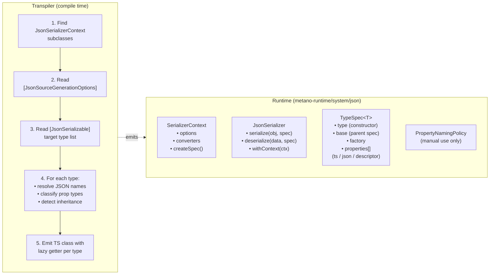

# Serialization Plan — `metano-runtime/system/json`

## Goal

Generate a declarative **TypeSpec** per serializable type that a generic runtime serializer
interprets to convert between TypeScript objects and JSON wire format. The transpiler
pre-computes all JSON property names at compile time — no naming-policy logic runs at
runtime.

---

## Design Principles

1. **Spec is data** — pure metadata, no logic. The transpiler generates it; the runtime
   interprets it.
2. **Pre-computed names** — the transpiler resolves `[JsonPropertyName]` overrides and
   naming policy (`CamelCase`, `SnakeCaseLower`, etc.) at transpile time. Every property
   in the spec carries an explicit `json` name.
3. **Mirror the C# model** — a `JsonSerializerContext` subclass in C# becomes a
   `SerializerContext` subclass in TS with lazy-initialized specs per type.
4. **Opt-in** — only types listed in `[JsonSerializable(typeof(T))]` get specs generated.
   Types outside a context are not affected.
5. **Custom converters** — pluggable at context construction for types that need
   non-standard serialization (e.g., `Decimal` as string instead of number).
6. **Herança by reference** — a derived type's spec references the base type's spec
   instead of flattening all properties.

---

## Architecture



---

## Runtime API (`metano-runtime/system/json`)

### Type Definitions

```typescript
// ---------- Type descriptors ----------

/** Primitives that JSON.stringify handles natively */
type PrimitiveDescriptor = { kind: "primitive" };

/** Another spec — recursive serialize/deserialize */
type RefDescriptor<T = unknown> = { kind: "ref"; spec: () => TypeSpec<T> };

/** Temporal types — toString() / T.from(str) */
type TemporalDescriptor = {
  kind: "temporal";
  parse: (iso: string) => unknown;
};

/** decimal.js — configurable: number (default) or string */
type DecimalDescriptor = { kind: "decimal" };

/** Map<K,V> — Object.fromEntries / new Map(Object.entries) */
type MapDescriptor = {
  kind: "map";
  key: TypeDescriptor;
  value: TypeDescriptor;
};

/** Array<T> */
type ArrayDescriptor = {
  kind: "array";
  element: TypeDescriptor;
};

/** HashSet<T> — spread to array / reconstruct */
type HashSetDescriptor = {
  kind: "hashSet";
  element: TypeDescriptor;
};

/** Branded type ([InlineWrapper]) — passthrough on serialize, create() on deserialize */
type BrandedDescriptor = {
  kind: "branded";
  create: (value: unknown) => unknown;
};

/** String enum — passthrough on serialize, validate on deserialize */
type EnumDescriptor = {
  kind: "enum";
  values: Record<string, string>; // the const object
};

/** Numeric enum — passthrough both ways */
type NumericEnumDescriptor = {
  kind: "numericEnum";
  values: Record<string, number>;
};

/** Nullable wrapper — delegates to inner descriptor */
type NullableDescriptor = {
  kind: "nullable";
  inner: TypeDescriptor;
};

type TypeDescriptor =
  | PrimitiveDescriptor
  | RefDescriptor
  | TemporalDescriptor
  | DecimalDescriptor
  | MapDescriptor
  | ArrayDescriptor
  | HashSetDescriptor
  | BrandedDescriptor
  | EnumDescriptor
  | NumericEnumDescriptor
  | NullableDescriptor;

// ---------- Property spec ----------

interface PropertySpec {
  /** TypeScript field name (camelCase) */
  ts: string;
  /** JSON wire name (pre-computed by transpiler) */
  json: string;
  /** How to convert between TS and JSON */
  type: TypeDescriptor;
  /** Property is optional (nullable in C#, no default) */
  optional?: boolean;
}

// ---------- Type spec ----------

interface TypeSpec<T = unknown> {
  /** Constructor reference (for instanceof checks) */
  type: new (...args: unknown[]) => T;
  /** Parent type's spec (herança) — properties are inherited */
  base?: TypeSpec;
  /** Constructs T from a Record<ts-field-name, value> of deserialized properties */
  factory: (props: Record<string, unknown>) => T;
  /** Own properties only (base properties come from base spec) */
  properties: PropertySpec[];
}
```

### SerializerContext

```typescript
/** Custom converter — overrides built-in handling for a type descriptor kind */
interface JsonConverter {
  kind: TypeDescriptor["kind"];
  serialize: (value: unknown) => unknown;
  deserialize: (value: unknown) => unknown;
}

interface SerializerContextOptions {
  /**
   * Naming policy instance — only used when constructing a context
   * manually at runtime (not from transpiler output, which pre-computes names).
   */
  propertyNamingPolicy?: PropertyNamingPolicy;
  /** Custom converters that override built-in type handling */
  converters?: JsonConverter[];
}

abstract class SerializerContext {
  readonly options: SerializerContextOptions;

  constructor(options?: SerializerContextOptions);

  /**
   * Helper for subclass lazy getters. Registers the spec in the context's
   * internal map (type constructor → spec) so withContext() lookups work.
   */
  protected createSpec<T>(spec: TypeSpec<T>): TypeSpec<T>;

  /**
   * Looks up a spec by constructor reference. Returns undefined if not
   * registered. Used by JsonSerializer.withContext() for generic dispatch.
   */
  resolve<T>(type: new (...args: unknown[]) => T): TypeSpec<T> | undefined;
}
```

### JsonSerializer

```typescript
class JsonSerializer {
  /**
   * Serialize a TS object to a JSON-safe plain object using the given spec.
   *
   *   JsonSerializer.serialize(order, JsonContext.default.order)
   *   // → { order_id: "abc", created_at: "2024-01-15T10:30:00", ... }
   */
  static serialize<T>(value: T, spec: TypeSpec<T>): Record<string, unknown>;

  /**
   * Deserialize unknown data (from JSON.parse) into a typed TS instance.
   *
   *   JsonSerializer.deserialize(data, JsonContext.default.order)
   *   // → Order { id: UserId("abc"), createdAt: Temporal.PlainDateTime, ... }
   */
  static deserialize<T>(data: unknown, spec: TypeSpec<T>): T;

  /**
   * Create a bound serializer that can resolve specs from the context.
   *
   *   const s = JsonSerializer.withContext(JsonContext.default);
   *   s.serialize(order, JsonContext.default.order);
   */
  static withContext(context: SerializerContext): BoundSerializer;
}

interface BoundSerializer {
  serialize<T>(value: T, spec: TypeSpec<T>): Record<string, unknown>;
  deserialize<T>(data: unknown, spec: TypeSpec<T>): T;
  /** Resolve spec by constructor — throws if not registered */
  specFor<T>(type: new (...args: unknown[]) => T): TypeSpec<T>;
}
```

### PropertyNamingPolicy

```typescript
/**
 * Available for manual context construction. The transpiler does NOT emit
 * references to these — it pre-computes all JSON names and embeds them
 * directly in the spec.
 */
abstract class PropertyNamingPolicy {
  abstract convert(name: string): string;

  static readonly camelCase: PropertyNamingPolicy;
  static readonly snakeCaseLower: PropertyNamingPolicy;
  static readonly snakeCaseUpper: PropertyNamingPolicy;
  static readonly kebabCaseLower: PropertyNamingPolicy;
  static readonly kebabCaseUpper: PropertyNamingPolicy;
}
```

---

## Transpiler Output — Generated Code Example

### Input (C#)

```csharp
[JsonSourceGenerationOptions(PropertyNamingPolicy = JsonKnownNamingPolicy.SnakeCaseLower)]
[JsonSerializable(typeof(Order))]
[JsonSerializable(typeof(OrderItem))]
public partial class JsonContext : JsonSerializerContext;

[Transpile]
public record Order(
    [property: JsonPropertyName("order_id")] UserId Id,
    DateTime CreatedAt,
    decimal Total,
    List<OrderItem> Items,
    Dictionary<string, int> Metadata,
    Status CurrentStatus,
    string? Note
);

[Transpile]
public record OrderItem(string Name, decimal Price);

[Transpile, InlineWrapper]
public readonly record struct UserId(string Value);

[Transpile, StringEnum]
public enum Status { Draft, Active, Completed }
```

### Output (TypeScript)

```typescript
import { SerializerContext, type TypeSpec } from "metano-runtime/system/json";
import { Order } from "#/models/order";
import { OrderItem } from "#/models/order-item";
import { UserId } from "#/shared-kernel/user-id";
import { Status } from "#/shared-kernel/status";
import { Decimal } from "decimal.js";
import { Temporal } from "@js-temporal/polyfill";

export class JsonContext extends SerializerContext {
  private static readonly _default = new JsonContext();
  static get default(): JsonContext {
    return this._default;
  }

  // -- Order --

  private _order?: TypeSpec<Order>;

  get order(): TypeSpec<Order> {
    return (this._order ??= this.createSpec({
      type: Order,
      factory: (p) =>
        new Order(
          p.id as UserId,
          p.createdAt as Temporal.PlainDateTime,
          p.total as Decimal,
          p.items as OrderItem[],
          p.metadata as Map<string, number>,
          p.currentStatus as Status,
          p.note as string | null,
        ),
      properties: [
        {
          ts: "id",
          json: "order_id",
          type: { kind: "branded", create: UserId.create },
        },
        {
          ts: "createdAt",
          json: "created_at",
          type: { kind: "temporal", parse: Temporal.PlainDateTime.from },
        },
        { ts: "total", json: "total", type: { kind: "decimal" } },
        {
          ts: "items",
          json: "items",
          type: {
            kind: "array",
            element: { kind: "ref", spec: () => this.orderItem },
          },
        },
        {
          ts: "metadata",
          json: "metadata",
          type: {
            kind: "map",
            key: { kind: "primitive" },
            value: { kind: "primitive" },
          },
        },
        {
          ts: "currentStatus",
          json: "current_status",
          type: { kind: "enum", values: Status },
        },
        {
          ts: "note",
          json: "note",
          type: { kind: "nullable", inner: { kind: "primitive" } },
        },
      ],
    }));
  }

  // -- OrderItem --

  private _orderItem?: TypeSpec<OrderItem>;

  get orderItem(): TypeSpec<OrderItem> {
    return (this._orderItem ??= this.createSpec({
      type: OrderItem,
      factory: (p) => new OrderItem(p.name as string, p.price as Decimal),
      properties: [
        { ts: "name", json: "name", type: { kind: "primitive" } },
        { ts: "price", json: "price", type: { kind: "decimal" } },
      ],
    }));
  }
}
```

### Pre-computed names

The transpiler resolved these at compile time:

| C# Property     | `[JsonPropertyName]` | Policy (snake_case) | Final `json`           |
| --------------- | -------------------- | ------------------- | ---------------------- |
| `Id`            | `"order_id"`         | —                   | `order_id` (attr wins) |
| `CreatedAt`     | —                    | `created_at`        | `created_at`           |
| `Total`         | —                    | `total`             | `total`                |
| `Items`         | —                    | `items`             | `items`                |
| `Metadata`      | —                    | `metadata`          | `metadata`             |
| `CurrentStatus` | —                    | `current_status`    | `current_status`       |
| `Note`          | —                    | `note`              | `note`                 |

No naming policy logic executes at runtime.

---

## Inheritance

### Input

```csharp
[Transpile]
public record Item(string Name, decimal Price);

[Transpile]
public record OrderItem(string Name, decimal Price, int Quantity) : Item(Name, Price);
```

### Output

```typescript
get item(): TypeSpec<Item> {
    return this._item ??= this.createSpec({
        type: Item,
        factory: (p) => new Item(p.name as string, p.price as Decimal),
        properties: [
            { ts: "name",  json: "name",  type: { kind: "primitive" } },
            { ts: "price", json: "price", type: { kind: "decimal" } },
        ],
    });
}

get orderItem(): TypeSpec<OrderItem> {
    return this._orderItem ??= this.createSpec({
        type: OrderItem,
        base: this.item,    // ← reference, not flattened
        factory: (p) => new OrderItem(
            p.name as string,
            p.price as Decimal,
            p.quantity as number,
        ),
        properties: [
            // only own properties — name and price come from base
            { ts: "quantity", json: "quantity", type: { kind: "primitive" } },
        ],
    });
}
```

The runtime walks the `base` chain to collect all properties during
serialize/deserialize:

```typescript
function collectProperties(spec: TypeSpec): PropertySpec[] {
  const base = spec.base ? collectProperties(spec.base) : [];
  return [...base, ...spec.properties];
}
```

---

## Custom Converters

### Registration

```typescript
const context = new JsonContext({
  converters: [
    // Decimal as string instead of number (for precision safety)
    {
      kind: "decimal",
      serialize: (d: Decimal) => d.toString(),
      deserialize: (v: string) => new Decimal(v),
    },
  ],
});
```

### Resolution order

1. Context-level converter (from `options.converters`) — user override
2. Built-in converter for the descriptor kind — default behavior

### Built-in converters

| Kind          | `serialize` (TS → JSON)                 | `deserialize` (JSON → TS)             |
| ------------- | --------------------------------------- | ------------------------------------- |
| `primitive`   | passthrough                             | passthrough                           |
| `temporal`    | `.toString()`                           | `descriptor.parse(str)`               |
| `decimal`     | `.toNumber()`                           | `new Decimal(val)`                    |
| `map`         | `Object.fromEntries()` + recurse values | `new Map(Object.entries())` + recurse |
| `array`       | `.map()` + recurse element              | `.map()` + recurse element            |
| `hashSet`     | `[...set]` + recurse element            | `new HashSet(arr.map(...))`           |
| `branded`     | passthrough (brand erases)              | `descriptor.create(val)`              |
| `enum`        | passthrough (already string)            | validate against `descriptor.values`  |
| `numericEnum` | passthrough                             | validate is number                    |
| `nullable`    | `null` passthrough, else recurse inner  | same                                  |
| `ref`         | recurse with referenced spec            | recurse with referenced spec          |

---

## Serialize / Deserialize Algorithms

### serialize(value, spec)

```
1. Collect all properties: walk spec.base chain + spec.properties
2. result = {}
3. For each property:
   a. Read value[prop.ts]
   b. If null and prop.optional → skip or set null (match C# behavior)
   c. Resolve converter: context override ?? built-in for prop.type.kind
   d. result[prop.json] = converter.serialize(tsValue)
4. Return result
```

### deserialize(data, spec)

```
1. Assert data is object (not null, not array)
2. Collect all properties: walk spec.base chain + spec.properties
3. props = {}
4. For each property:
   a. Read data[prop.json]
   b. If undefined/null and prop.optional → props[prop.ts] = null
   c. Resolve converter: context override ?? built-in for prop.type.kind
   d. props[prop.ts] = converter.deserialize(jsonValue)
5. Return spec.factory(props)
```

---

## Without JsonSerializerContext

When the user doesn't write a `JsonSerializerContext`, serialization specs are NOT
generated. The user can still:

1. **Manually create a context at runtime** using `PropertyNamingPolicy`:

```typescript
import {
  SerializerContext,
  PropertyNamingPolicy,
} from "metano-runtime/system/json";

class MyContext extends SerializerContext {
  constructor() {
    super({ propertyNamingPolicy: PropertyNamingPolicy.camelCase });
  }

  // Hand-written specs...
}
```

2. **Use `[PlainObject]` types** directly with `JSON.parse()`/`JSON.stringify()` — they
   are already interfaces (no constructor, no conversion needed). PlainObject is
   unchanged by this feature.

---

## Transpiler Implementation Steps

### Phase 1 — Runtime library (`metano-runtime/system/json`)

- [ ] Define `TypeSpec`, `PropertySpec`, `TypeDescriptor` types
- [ ] Implement `SerializerContext` base class
- [ ] Implement `JsonSerializer.serialize()` and `deserialize()`
- [ ] Implement built-in converters for all descriptor kinds
- [ ] Implement `PropertyNamingPolicy` (for manual use)
- [ ] Tests: unit tests for each converter, round-trip tests for nested types

### Phase 2 — Transpiler: detect and read metadata

- [ ] Detect `JsonSerializerContext` subclasses in the compilation
  - Walk `compilation.SyntaxTrees`, find classes inheriting `JsonSerializerContext`
  - Read `[JsonSourceGenerationOptions]` for naming policy + defaults
- [ ] Collect `[JsonSerializable(typeof(T))]` attributes → set of target types
- [ ] For each target type, collect serializable properties:
  - Exclude `[JsonIgnore]`
  - Read `[JsonPropertyName]` overrides
  - Detect `[JsonRequired]`
  - Resolve nullability
- [ ] Pre-compute JSON wire names: `[JsonPropertyName]` ?? `policy.convert(csharpName)`
- [ ] Classify each property's TypeDescriptor kind based on the TS type mapping

### Phase 3 — Transpiler: emit the context class

- [ ] New transformer: `JsonContextTransformer` (or handler within existing pipeline)
- [ ] Generate `class XxxContext extends SerializerContext` with:
  - Static `default` singleton
  - Lazy getter per `[JsonSerializable]` type
  - Pre-computed `TypeSpec` with all property specs
- [ ] Handle inheritance: detect base type, emit `base: this.baseSpec` reference
- [ ] Handle cross-package refs: if a serializable type comes from another package,
      import its spec or inline the descriptor
- [ ] Emit proper imports (runtime, types, Temporal, Decimal, etc.)

### Phase 4 — Naming policy implementations (compile-time)

- [ ] `CamelCase`: `FirstName` → `firstName`
- [ ] `SnakeCaseLower`: `FirstName` → `first_name`
- [ ] `SnakeCaseUpper`: `FirstName` → `FIRST_NAME`
- [ ] `KebabCaseLower`: `FirstName` → `first-name`
- [ ] `KebabCaseUpper`: `FirstName` → `FIRST-NAME`
- [ ] `null` (default): `FirstName` → `FirstName` (preserve PascalCase)
- [ ] Unit tests for each policy with edge cases (acronyms, numbers, etc.)

### Phase 5 — End-to-end validation

- [ ] Add `JsonContext` to `SampleTodo` → verify round-trip in bun tests
- [ ] Add `JsonContext` to `SampleIssueTracker` → complex types, inheritance, branded IDs
- [ ] Add `JsonContext` to `SampleTodo.Service` → Hono integration (request/response)
- [ ] Verify custom converters work (Decimal as string scenario)

---

## Edge Cases

| Case                                    | Handling                                                        |
| --------------------------------------- | --------------------------------------------------------------- |
| `[JsonIgnore]`                          | Property excluded from spec                                     |
| `[JsonRequired]`                        | `optional: false` (deserialize throws if missing)               |
| `[JsonPropertyName]` + policy           | Attribute wins, policy ignored for that property                |
| Nullable reference type (`string?`)     | `{ kind: "nullable", inner: { kind: "primitive" } }`            |
| Nullable value type (`int?`)            | Same nullable wrapper                                           |
| `[InlineWrapper]` in a property         | `{ kind: "branded", create: T.create }`                         |
| `[StringEnum]` in a property            | `{ kind: "enum", values: EnumObj }`                             |
| Nested array (`List<List<T>>`)          | `{ kind: "array", element: { kind: "array", element: ... } }`   |
| `Dictionary<string, Order>`             | `{ kind: "map", key: primitive, value: { kind: "ref", spec } }` |
| Type not in context                     | Not generated — no spec, no serialization support               |
| Circular references                     | `spec: () => this.xxx` (lazy getter breaks the cycle)           |
| `[PlainObject]` types                   | Unchanged — remain interfaces, no spec generated                |
| `[NoTranspile]` / `[NoEmit]` on context | Context class itself not emitted                                |
| Generic types (`Result<T>`)             | Future — not in scope for Phase 1                               |

---

## Out of Scope (Future)

- **Generic type specs** (`TypeSpec<Result<T>>`) — requires type-argument-aware specs
- **Polymorphic deserialization** (`[JsonDerivedType]`) — discriminated unions
- **Stream serialization** — serialize to `ReadableStream` / `Uint8Array`
- **Validation beyond type checks** — `[Range]`, `[StringLength]`, etc.
- **`[JsonExtensionData]`** — catch-all property for unknown JSON fields
