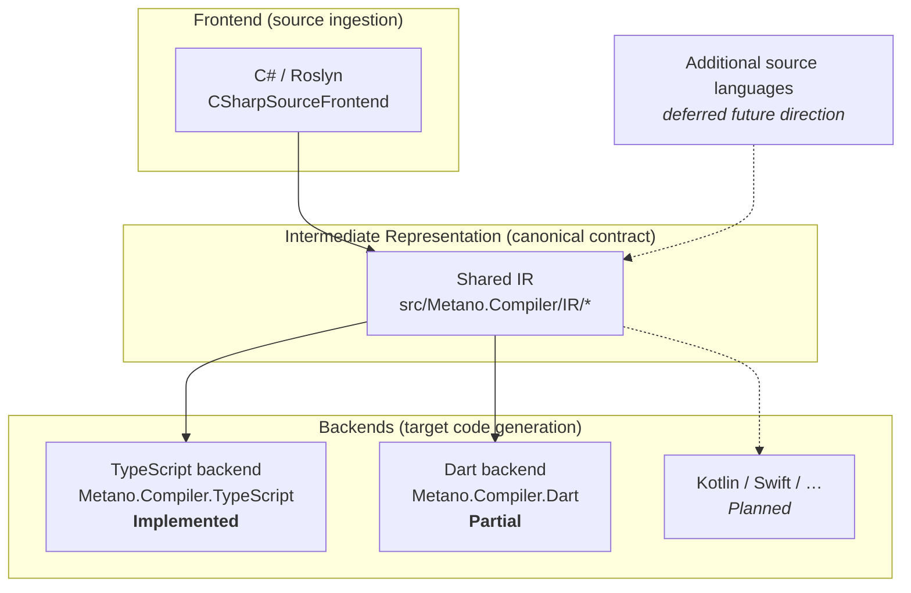

# Metano Baseline — Architecture Overview

> Canonical baseline of what Metano does **today**. Framed in compiler terms.
> Companion docs: [feature-support-matrix.md](./feature-support-matrix.md),
> [attribute-catalog.md](./attribute-catalog.md), [diagnostic-catalog.md](./diagnostic-catalog.md).

## What Metano is

Metano is a Roslyn-powered **source-to-source transpiler**. It reads annotated C#, transforms it
through a canonical intermediate representation, and emits idiomatic code in one or more target
languages. Its product thesis: carry domain knowledge written in C# into target code that is usable,
readable, and operational — not "run .NET in the browser."

## Frontend / IR / Backend (the hourglass)

In compiler terminology Metano has three stages. The **IR is the waist of the hourglass**: the stable
contract that decouples source ingestion from target emission.

| Stage | Role | Today | Where |
| --- | --- | --- | --- |
| **Frontend** | Ingest a source language → produce IR | **C# / Roslyn only** | `src/Metano.Compiler/CSharpSourceFrontend.cs` |
| **IR** | Canonical, language-neutral semantic model | Single shared IR | `src/Metano.Compiler/IR/*` |
| **Backend port** | The seam every backend implements | `ITranspilerTarget` | `src/Metano.Compiler/ITranspilerTarget.cs` |
| **Backend: TypeScript** | Reference target; drives `metano-typescript` CLI | **Implemented** | `src/Metano.Compiler.TypeScript/` |
| **Backend: Dart/Flutter** | Second target | **Partial** (see matrix gaps) | `src/Metano.Compiler.Dart/` |
| **Orchestration** | load → compile → IR → target.Transform → write | — | `src/Metano.Compiler/TranspilerHost.cs` |

> Note on terminology: "frontend" = source-language ingestion (C#/Roslyn), "backend" = target-language
> code generation (TypeScript, Dart). This is the proper compiler usage and supersedes any informal
> "frontend = browser code" reading. C# is the **only** frontend today, but the IR is kept
> frontend-agnostic so additional source languages remain conceivable later (a deferred direction, not
> a current commitment).

## Pipeline

1. User marks C# types via Metano attributes (see attribute catalog).
2. `TranspilerHost` loads + compiles the C# project through Roslyn (the frontend).
3. Eligible types are discovered and lowered into the **shared IR**.
4. The selected **backend** (`ITranspilerTarget`) transforms IR → its target AST.
5. Imports, barrels, and package metadata are resolved.
6. The backend prints target source files into the output directory.

## Customization & contract surface

- **~27 attributes** in `Metano.Annotations` (+ target-specific attributes in the TypeScript backend)
  drive naming, emission shape, modules, packaging, and declarative lowering. See the attribute catalog.
- **25 stable diagnostics** (`MS0001`–`MS0025`) form the troubleshooting contract. See the diagnostic
  catalog.
- **Cross-package** output: `[EmitPackage]` declares npm identity; dependencies propagate into the
  consumer `package.json`.

## What's explicitly NOT in scope

- Running IL/.NET in the browser; full .NET runtime simulation.
- Unrestricted coverage of the entire C# language surface (Metano supports a deliberate subset).
- Source-map-style C# → target debug tracing as a core guarantee.

## Where to go next

- **What is supported today** → [feature-support-matrix.md](./feature-support-matrix.md)
- **What is planned** → [../roadmap/00-roadmap.md](../roadmap/00-roadmap.md)
- **Why decisions were made** → `docs/adr/` (24 ADRs; IR rationale in ADR-0013, target-agnostic core in ADR-0001)
