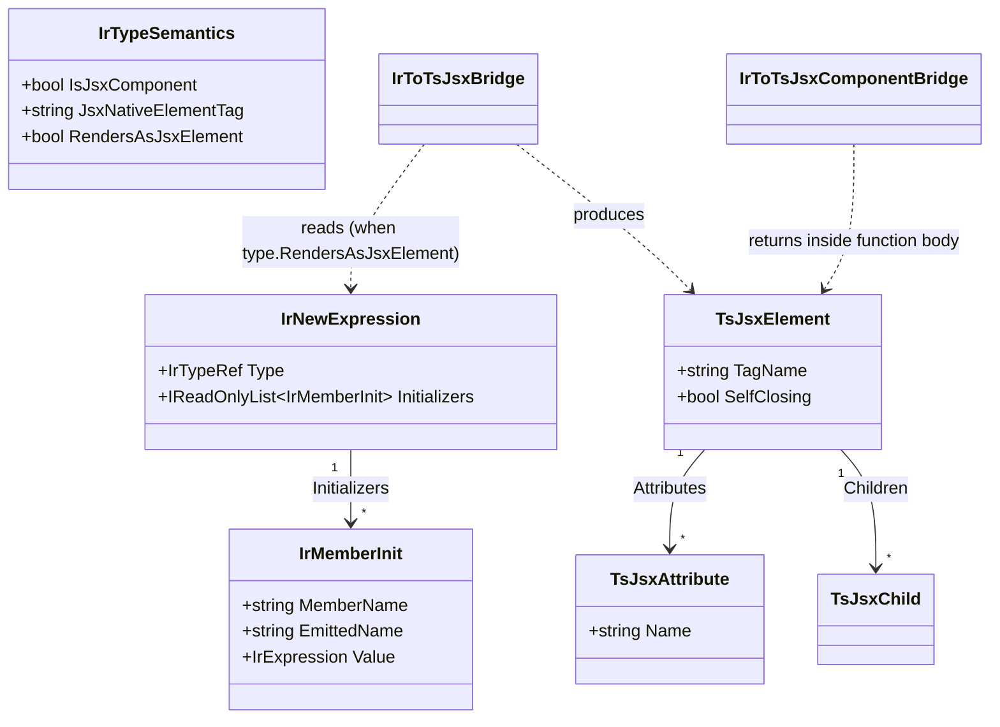

# Data Model: JSX/TSX from C#

**Feature**: `002-jsx-codegen-from-csharp` | **Date**: 2026-06-01

The "data model" of a transpiler feature is its **IR additions** (target-agnostic, in `Metano.Compiler`) and its **target AST additions** (TypeScript adapter, in `Metano.Compiler.TypeScript`). Field names below are proposals; final signatures land in implementation. Existing records are shown abbreviated with the new fields marked **NEW**.

## A. Core IR (Metano.Compiler) — additions

### A1. `IrTypeSemantics` (extend)

`IR/IrTypeSemantics.cs` — add three optional members (defaults keep all non-JSX types unchanged):

```csharp
public sealed record IrTypeSemantics(
    bool IsRecord = false,
    bool IsValueType = false,
    bool IsStatic = false,
    bool IsAbstract = false,
    bool IsSealed = false,
    bool IsPlainObject = false,
    bool IsException = false,
    bool IsBranded = false,
    IrTypeRef? BrandedUnderlyingType = null,
    // NEW
    bool IsJsxComponent = false,        // derives from a [JsxComponentBuilder] base; emit as function component
    string? JsxNativeElementTag = null, // [JsxNativeElement("tag")] → intrinsic <tag>
    bool RendersAsJsxElement = false    // renderable in value position (component | native | imported renderable)
);
```

**Relationships / rules**:
- `JsxNativeElementTag is not null` ⇒ `RendersAsJsxElement == true`.
- `IsJsxComponent == true` ⇒ `RendersAsJsxElement == true` (a component used in a child position renders as `<Name/>`).
- An `[Import]`-ed renderable typed as/convertible to the marked `JsxElement` ⇒ `RendersAsJsxElement == true`, `IsJsxComponent == false`, `JsxNativeElementTag == null`.
- The abstract builder base itself (`JsxComponent`) is `IsJsxComponent == false` (it is the marker carrier, not an emittable component).

**Populated by**: `IrClassExtractor.ExtractSemantics` via new `SymbolHelper` predicates (B below).

### A2. `IrNewExpression` (extend)

`IR/IrExpression.cs` — add ordered object-initializer member assignments:

```csharp
public sealed record IrNewExpression(
    IrTypeRef Type,
    IReadOnlyList<IrArgument> Arguments,
    bool IsPlainObject = false,
    IReadOnlyList<string>? ParameterNames = null,
    bool IsObjectArgsCtor = false,
    // NEW
    IReadOnlyList<IrMemberInit>? Initializers = null   // from `new T { Member = value, ... }`
) : IrExpression;

/// New supporting record (IR/IrExpression.cs).
/// MemberName = original C# property name; EmittedName = [Name] override or null
/// (the backend camelCases when null). Value = lowered assignment expression.
public sealed record IrMemberInit(string MemberName, string? EmittedName, IrExpression Value);
```

**Rules**:
- `Initializers` is null when the source `new` has no object-initializer clause (preserves existing behavior for every current test).
- `EmittedName` is resolved at extraction time from the assigned member symbol via `SymbolHelper.GetNameOverride(member, TargetLanguage.TypeScript)`.
- Order is source order (children/attribute order must be stable per FR-010).

**Populated by**: `IrExpressionExtractor.BuildNewExpression` reading `ObjectCreationExpressionSyntax.Initializer` (and the implicit form).

## B. Core symbol helpers (Metano.Compiler) — additions

`SymbolHelper.cs` (mirrors `HasPlainObject`/`HasExternal` style; the JSX markers are in namespace `Metano.Annotations.TypeScript`):

```csharp
public static bool HasJsxComponentBuilder(this ISymbol symbol);   // [JsxComponentBuilder] present
public static string? GetJsxNativeElementTag(this ISymbol symbol);// [JsxNativeElement("tag")] → "tag"
public static bool DerivesFromJsxComponentBuilder(this INamedTypeSymbol type); // walk base chain
public static bool IsJsxRenderable(this ITypeSymbol type);        // component | native | imported renderable typed as JsxElement
```

`DerivesFromJsxComponentBuilder` walks `type.BaseType` until it finds a type carrying `[JsxComponentBuilder]` (the base) or runs out. `IsJsxRenderable` additionally accepts a type that is, or is implicitly convertible to, the marked `JsxElement` type and carries `[Import]`/`[External]` (the imported-renderable case for FR-022).

## C. Diagnostics (Metano.Compiler) — addition

`Diagnostics/MetaSharpDiagnostic.cs`:

```csharp
/// <summary>MS0026 — A type used in a JSX-renderable position cannot be recognized
/// as a component, a [JsxNativeElement], or an imported renderable typed as JsxElement;
/// or a [JsxComponentBuilder] base is misapplied (Render() must return the marked
/// element type). Pair the type with the appropriate marker, or [Import]/[External]
/// for library-provided renderables.</summary>
public const string JsxRenderableUnrecognized = "MS0026";
```

Raised as `new MetanoDiagnostic(MetanoDiagnosticSeverity.Error, DiagnosticCodes.JsxRenderableUnrecognized, message, location)`.

## D. TypeScript AST (Metano.Compiler.TypeScript) — new nodes

All under `TypeScript/AST/`, one record per file, inheriting the existing bases.

### D1. `TsJsxElement` : `TsExpression`

```csharp
public sealed record TsJsxElement(
    string TagName,                              // "div" | "Counter" | "For"
    IReadOnlyList<TsJsxAttribute> Attributes,
    IReadOnlyList<TsJsxChild> Children,
    bool SelfClosing = false                     // true when Children is empty
) : TsExpression;
```

- `TagName` lowercase ⇒ intrinsic element; capitalized ⇒ component (TS/JSX convention is preserved automatically by the emitted casing).

### D2. `TsJsxAttribute` + value union

```csharp
public sealed record TsJsxAttribute(string Name, TsJsxAttributeValue Value);

public abstract record TsJsxAttributeValue;
public sealed record TsJsxAttributeStringValue(string Value) : TsJsxAttributeValue;     // name="literal"
public sealed record TsJsxAttributeExpressionValue(TsExpression Expression) : TsJsxAttributeValue; // name={expr}
```

### D3. `TsJsxChild` union

```csharp
public abstract record TsJsxChild;
public sealed record TsJsxText(string Value) : TsJsxChild;                       // literal text
public sealed record TsJsxExpressionChild(TsExpression Expression) : TsJsxChild; // {expr} (incl. render-prop lambdas)
public sealed record TsJsxElementChild(TsJsxElement Element) : TsJsxChild;       // nested element
```

### D4. `TsSourceFile` / file extension

No new field required. The `.tsx` decision is computed in `TypeTransformer.TransformGroup` and threaded through `PathNaming.GetRelativePath(ns, typeName, isJsx: bool)`; the resulting `FileName` already carries the extension.

## E. Printer dispatch (Printer.cs)

Add to `PrintExpression`'s switch:
```
case TsJsxElement jsx: PrintJsxElement(jsx); break;
```
New private helpers `PrintJsxElement`, `PrintJsxAttribute`, `PrintJsxChild` emit `<tag …>children</tag>` / `<tag … />`, `name="…"` / `name={…}`, and text/`{expr}`/nested element respectively. `ImportCollector.CollectReferencedTypeNames` is extended to recurse into JSX nodes so component/`For`/imported names are collected as **value** imports.

## F. Entity relationship overview



## G. Worked transformation (the prototype `Counter`)

**Input** (`samples/SampleSolidUi/Ui/Counter.cs`, abbreviated):
```csharp
public sealed record Counter : JsxComponent {
    public int Count { get; init; }
    public override JsxElement Render() {
        var count = Solid.CreateSignal(Count);
        MouseClickHandler<Html.Button> decrement = _ => count.Set(count.Value - 1);
        return new Html.Div {
            ClassName = "counter",
            Children = [ new Html.Button { ClassName = "action", OnClick = decrement, Children = [Text("-")] },
                         new Html.Span { ClassName = "display", Children = [Text(count.Value)] }, ],
        };
    }
}
```

**IR (sketch)**: `IrClassDeclaration{ Semantics{ IsJsxComponent=true, RendersAsJsxElement=true } }`; props from `Count` (settable). `Render()` body = var decl `count = call(Solid.CreateSignal, [Count])`; `IrNewExpression{ Type=Html.Div, Initializers=[ MemberInit("ClassName","class","counter"), MemberInit("Children", null, array[...]) ] }` (ClassName's `EmittedName` is `class` because the Solid binding adds `[Name("class")]`).

**Output** (`targets/js/sample-solid-ui/src/ui/counter.tsx`, target shape per spec):
```tsx
import { createSignal } from "solid-js";

export type CounterProps = {
  count?: number;
};

export function Counter(props: CounterProps) {
  const props$count = props.count ?? 0;
  const count = createSignal(props$count);
  const decrement = () => count[1](count[0]() - 1);
  return (
    <div class="counter">
      <button class="action" onClick={decrement}>-</button>
      <span class="display">{count[0]()}</span>
    </div>
  );
}
```

(`onClick` is camelCase by default; `class` comes from `[Name("class")]` on the binding. The exact `props$count` local name and whitespace are pinned by the golden file.)
