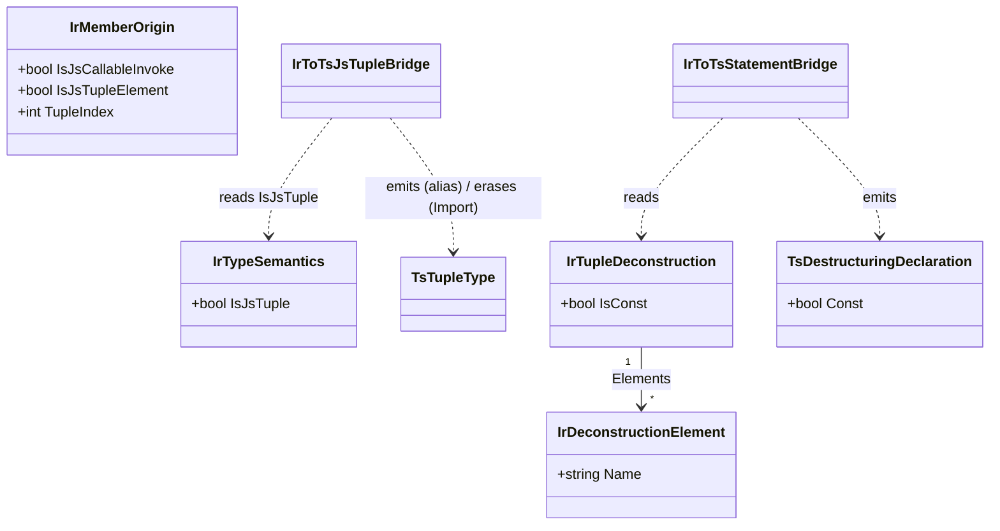

# Data Model: JS-Interop Primitives

**Feature**: `003-js-interop-primitives` | **Date**: 2026-06-01

IR additions (target-agnostic core) + TypeScript AST additions (adapter). Field names are proposals; final signatures land in implementation. Existing records shown abbreviated with new fields marked **NEW**.

## A. Attributes (Metano.Annotations.TypeScript) — new

```csharp
namespace Metano.Annotations.TypeScript;

/// <summary>Marks a positional record as a JS array-tuple (the array-shape
/// sibling of [PlainObject]). Emits a tuple type alias `= [T0, T1, ...]` when
/// standalone, or is erased when combined with [Import] (the type resolves to
/// the imported library tuple). No class / equals / hashCode / with is emitted.
/// Positional member access lowers to array index. TypeScript-specific; no-op
/// for other targets.</summary>
[AttributeUsage(AttributeTargets.Class | AttributeTargets.Struct, Inherited = false)]
public sealed class JsTupleAttribute : Attribute;

/// <summary>Marks an erased interface modeling a JS callable value. Calls to its
/// Invoke(...) method(s) lower to direct invocation of the receiver
/// (recv.Invoke(a) → recv(a)); overloaded Invoke is supported. No declaration is
/// emitted. TypeScript-specific; no-op for other targets.</summary>
[AttributeUsage(AttributeTargets.Interface, Inherited = false)]
public sealed class JsCallableAttribute : Attribute;
```

## B. Core IR (Metano.Compiler) — additions

### B1. `IrTypeSemantics` (extend) — `IR/IrTypeSemantics.cs`

```csharp
public sealed record IrTypeSemantics(
    bool IsRecord = false,
    /* … existing … */
    bool IsBranded = false,
    IrTypeRef? BrandedUnderlyingType = null,
    // NEW
    bool IsJsTuple = false   // [JsTuple] — lower as a positional JS array-tuple
);
```

### B2. `IrMemberOrigin` (extend) — `IR/IrExpression.cs`

```csharp
public sealed record IrMemberOrigin(
    /* … existing: MemberName, IsStatic, EmittedName, IsPlainObjectInstanceMethod,
       IsDeclaringTypeExternal, IsDeclaringTypeNoContainer, … */
    // NEW
    bool IsJsCallableInvoke = false,   // call is Invoke on a [JsCallable] interface → recv(args)
    bool IsJsTupleElement = false,     // member access is a [JsTuple] positional element
    int TupleIndex = -1                // positional index when IsJsTupleElement
);
```

### B3. `IrTupleDeconstruction` (new) — `IR/IrStatement.cs`

```csharp
/// `var (a, b) = expr;` — a deconstructing variable declaration.
public sealed record IrTupleDeconstruction(
    IReadOnlyList<IrDeconstructionElement> Elements,
    IrExpression Initializer,
    bool IsConst = true
) : IrStatement;

/// One slot of a deconstruction. Name is null for a discard (`_`).
public sealed record IrDeconstructionElement(string? Name, IrTypeRef? Type = null);
```

(Existing `IrVariableDeclaration(string Name, IrTypeRef?, IrExpression?, bool IsConst)` is unchanged.)

## C. Diagnostics — `Diagnostics/MetaSharpDiagnostic.cs`

```csharp
/// <summary>MS0027 — [JsTuple] applied to a type with no positional shape
/// (non-positional record/class); there is no field order to map to array slots.</summary>
public const string InvalidJsTuple = "MS0027";

/// <summary>MS0028 — [JsCallable] applied to a non-interface, or a [JsCallable]
/// interface declaring members other than Invoke.</summary>
public const string InvalidJsCallable = "MS0028";
```

(MS0026 is intentionally skipped — reserved by branch `002`.)

## D. TypeScript AST (Metano.Compiler.TypeScript) — additions

### D1. `TsDestructuringDeclaration` (new) — `TypeScript/AST/TsDestructuringDeclaration.cs`

```csharp
/// `const [a, , b] = init;` — array-pattern binding. A null entry is a discard hole.
public sealed record TsDestructuringDeclaration(
    IReadOnlyList<string?> Names,
    TsExpression Initializer,
    bool Const = true,
    bool Exported = false
) : TsStatement;
```

Printer (`Printer.cs`): `const [a, , b] = <init>;` — join names with `, `, emitting an empty slot for null.

### D2. Reused existing AST
- `TsTupleType(IReadOnlyList<TsType> Elements)` — already exists, prints `[T0, T1]`. Used for the `[JsTuple]` type alias.
- `TsTypeAlias(string Name, TsType, …)` — for `export type Signal<T> = [...]` (standalone `[JsTuple]`).
- `TsElementAccess` — for positional member access `value[i]`.
- `TsCallExpression(callee, args)` — for `recv(args)` from `Invoke`.

## E. Emission routing

- `TypeTransformer.BuildTypeStatements` cascade gains `TryEmitJsTuple` **before** `TryEmitPlainObjectOrClass` (mirrors `TryEmitPlainObjectViaIr`). `[JsTuple]` + `[Import]` → no emission (erased). `[JsCallable]` interface → no emission (erased, like `[External]`).
- `IrToTsExpressionBridge.MapCall` gains a branch (parallel to the PlainObject-instance-method branch) for `IsJsCallableInvoke` → `TsCallExpression(receiver, args)`.
- `IrToTsExpressionBridge` member-access lowering gains a branch for `IsJsTupleElement` → `TsElementAccess(receiver, TupleIndex)`.
- `IrToTsStatementBridge` maps `IrTupleDeconstruction` → `TsDestructuringDeclaration`.

## F. Entity relationship overview



## G. Worked transformation (the motivating `Signal<T>`, inline test binding)

**Input** (self-contained, no external SolidJS binding needed):
```csharp
[JsTuple, Import("Signal", from: "solid-js")]
public record Signal<T>(Func<T> Getter, ISignalSetter<T> Setter);

[JsCallable, External]
public interface ISignalSetter<T> {
    void Invoke(T value);
    void Invoke(Func<T, T> updater);
}

public static class Solid {
    [Import("createSignal", from: "solid-js")]
    public static Signal<T> CreateSignal<T>(T initial) => throw new NotSupportedException();
}

// usage in a transpiled method body:
var (count, setCount) = Solid.CreateSignal(0);
Console.WriteLine(count());
setCount.Invoke(count() + 1);
setCount.Invoke(c => c + 1);
```

**Output**:
```ts
import { createSignal } from "solid-js";

const [count, setCount] = createSignal(0);
console.log(count());
setCount(count() + 1);
setCount(c => c + 1);
```

- `Signal<T>` is erased (`[JsTuple, Import]` → resolves to Solid's `Signal`); never `new`'d.
- `var (count, setCount)` → `const [count, setCount]`.
- `count` is `Func<T>` → `count()` (no `[Emit]`).
- `setCount.Invoke(x)` → `setCount(x)` (via `[JsCallable]`, no `[Emit]`).
- `ISignalSetter<T>` erased.
