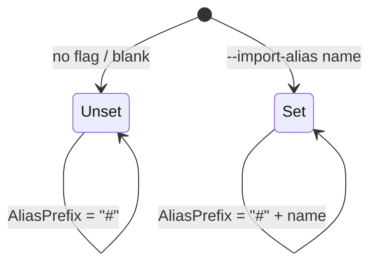

# Phase 1 Data Model: Configurable Isolated Subpath-Import Alias

This feature has no persistent or runtime data model. The relevant "entities" are
the configuration value and the derived emission artifacts that flow through the
TypeScript target adapter at transpile time.

## Entity: Import Alias (configured value)

The developer-supplied alias name.

| Attribute | Description |
|-----------|-------------|
| Raw value | The string passed via `--import-alias` / `MetanoImportAlias`. May be `null`/absent. |
| Normalized value | Trimmed; a single leading `#` stripped if present; empty/whitespace → treated as absent. |
| Effective state | `Unset` → default key `#`; `Set(name)` → key `#<name>`. |

**Validation rules (FR-007)**:
- `null`, `""`, or whitespace-only → **Unset** (legacy `#` behavior).
- `"contracts"` and `"#contracts"` → both normalize to name `contracts`.
- Surrounding whitespace is trimmed before use.

**State diagram**:



## Entity: Alias Prefix (derived, in-memory)

Computed once in `PathNaming` from the normalized alias.

| Effective state | `AliasPrefix` | Bare-root specifier | Namespace specifier |
|-----------------|---------------|---------------------|---------------------|
| Unset | `#` | `#` | `#/<ns>` |
| Set(`contracts`) | `#contracts` | `#contracts` | `#contracts/<ns>` |

The same-namespace import (`./<kebab-type>`) is **never** aliased (relative import,
avoids barrel self-cycles).

## Entity: Generated `package.json` imports entries (output)

Produced by `PackageJsonWriter.BuildImports`. Exactly two keys are emitted; which
two depends on the alias state.

| Effective state | Pattern key (`starKey`) | Root key (`rootKey`, only if a root barrel exists) |
|-----------------|-------------------------|----------------------------------------------------|
| Unset | `#/*` | `#` |
| Set(`contracts`) | `#contracts/*` | `#contracts` |

Each key maps to a conditional object:

```json
{
  "types":   "./<dist>/<outputPrefix>/<...>.d.ts",
  "import":  "./<dist>/<outputPrefix>/<...>.js",
  "default": "./<src>/<...>.ts"
}
```

**Invariants**:
- When `Set`, the default `#`/`#/*` keys are **never written** (the writer only ever
  emits `starKey`/`rootKey`), so a host project's own `#`/`#/*` is preserved (FR-003).
- Path values contain no doubled separators at any depth — `outputPrefix` is
  trailing-trimmed before interpolation (FR-008).
- Existing user-authored keys are preserved by the write-if-missing merge; alias
  keys are additive (Edge case: user `#`/`#/*` + alias coexist).

## Entity: Import graph node key (cycle detector, internal)

`CyclicReferenceDetector` normalizes in-file specifiers to graph keys.

| Specifier (Unset) | Specifier (Set `contracts`) | Normalized key |
|-------------------|-----------------------------|----------------|
| `#` | `#contracts` | `""` (root) |
| `#/<ns>` | `#contracts/<ns>` | `<ns>` |
| `./<file>` | `./<file>` (unchanged) | relative path |

**Invariant (FR-009)**: cross-namespace edges are recognized under the active alias,
so cycles are still detected (no false negatives).
