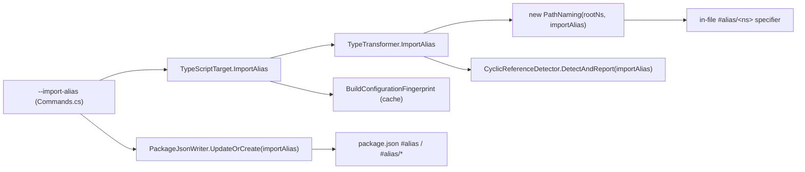

# Phase 0 Research: Configurable Isolated Subpath-Import Alias

All decisions below were resolved during exploration of the current Metano
codebase; no `NEEDS CLARIFICATION` remains. File:line references are to the code as
it exists on `main` at the time of writing.

## Decision 1 — Mechanism: isolated subpath-import alias (not a relative base path, not reusing `--src-root`)

**Decision**: Introduce a configurable, isolated Node.js subpath-import **alias key**
(default `#`, e.g. `#contracts` when set) for internal imports.

**Rationale**: The failure has two coupled causes — (a) a **key collision** (host
project also uses `#`/`#/*`) and (b) a **specifier assumption** (the in-file
`#/<ns>` ignores the output directory, see `PathNaming.ComputeRelativeImportPath`,
`PathNaming.cs:81-87`). A distinct alias key whose `package.json` target encodes the
output-subfolder depth fixes both at once: the key no longer collides, and the alias
target absorbs the depth so the specifier resolves correctly regardless of nesting.

**Alternatives considered**:
- *Relative/base path between generated files*: would emit brittle `../../../`
  chains and fights the existing namespace-rooted barrel layout
  (`PathNaming.GetRelativePath`). Rejected.
- *Reuse `--src-root` / `OutputPrefix.Resolve`*: those shape the **path values** of
  `package.json` entries, never the **key** (`#`) and never the in-file specifier
  (`OutputPrefix.cs`; `PackageJsonWriter.cs:353-385`). They cannot address a key
  collision. Rejected.

## Decision 2 — Node subpath-import key form: `#name` + `#name/*`

**Decision**: The alias key is `#<name>` (literal) plus `#<name>/*` (pattern). The
in-file specifier is `#<name>/<ns>` (and bare `#<name>` for the root-namespace case).

**Rationale**: Node `imports` keys must start with `#`. `#contracts` and
`#contracts/*` are exactly the shape the writer already emits for `#`/`#/*`, just
with a longer literal — proven legitimate by the existing user-merge test
(`EmitPackageTests.cs`, the `#custom/*` case). `#/contracts` (extra slash) is a
*subpath under the `#/*` pattern*, so it would only resolve if a `#/*` alias existed
— exactly the alias we are avoiding — and is therefore normalized away.

## Decision 3 — Opt-in (default behavior unchanged)

**Decision**: The alias is opt-in. With no configuration, `AliasPrefix == "#"` and
the writer emits `#`/`#/*` — byte-identical to today.

**Rationale**: Backward compatibility is a release gate (Spec SC-002). The repo's
own samples emit into their package src root where `#/*` is correct, and ~hundreds
of golden fixtures pin the `#/...` form. A default change would force regeneration
of all of them and diverge from the repo's `#/*` convention. Opt-in is the minimal,
Principle-VI-aligned choice.

## Decision 4 — Configuration surface: CLI flag + MSBuild property (no `metano.json`)

**Decision**: New `--import-alias <name>` flag on `metano-typescript`
(`Commands.cs`) and a mirrored `MetanoImportAlias` MSBuild property
(`Metano.Build.targets`).

**Rationale**: This is the established knob pattern (`--dist`, `--src-root`,
`--package-root`, `--namespace-barrels`). No configuration-file mechanism exists in
Metano today (`metano.json` is only a prose example in `CLAUDE.md`); introducing one
would be the first config-file layer and is unjustified for a single knob (YAGNI,
Principle VI). A future `metano.json` can reuse the same value.

## Decision 5 — Placement: TypeScript adapter only (core untouched)

**Decision**: The alias lives in the TS target adapter
(`Commands.cs` → `TypeScriptTarget` → `TypeTransformer` → `PathNaming`, and
`Commands.cs` → `PackageJsonWriter`). It is **not** added to the target-agnostic
`TranspileOptions` (`src/Metano.Compiler/`).

**Rationale**: The alias shapes TypeScript subpath imports — a language-specific
emission concern. `TranspileOptions` documents that target-specific flags live in
the target CLI layer (the same place `--dist`/`--src-root` already live). Keeping it
out of the core preserves inward-pointing dependencies (Constitution Principle IV).

## Decision 6 — Cache correctness: alias enters the configuration fingerprint

**Decision**: Append the alias to `TypeScriptTarget.BuildConfigurationFingerprint`.

**Rationale**: The incremental cache keys generated output on a configuration
fingerprint. Flipping the alias changes every internal specifier; without it in the
fingerprint, a cached run would reuse stale `#/...` output. This satisfies Spec
FR-010.

## Decision 7 — Cross-package / `exports` path is NOT changed

**Decision**: Leave the cross-package import path and `package.json#exports`
generation untouched.

**Rationale**: Consumers import a referenced package by its **npm name**
(`ImportCollector.cs:222-225`; `PathNaming.ComputeSubPath`), which never sees the
producer's local `imports` map — so the internal alias cannot collide with or affect
any downstream import. The producer's `exports` already encode nested-output depth
via `outputPrefix` (`PackageJsonWriter.BuildExports`). Internal-alias-only is
sufficient (Spec FR-006). Verified end-to-end against the `SampleTodo.Service`
cross-package sample.

## Decision 8 — Bundle the double-slash path fix

**Decision**: Fix the nested-output double-slash bug (`.../contracts//index.d.ts`)
as part of this feature.

**Rationale**: `outputPrefix` is interpolated into `distBase` without trailing-trim
(`PackageJsonWriter.cs:362`) while `src` is trimmed (`:360`); the twin bug is in
`BuildExports` (`:401`). The defect manifests precisely in the nested-output
scenario this feature targets, so fixing it here is cohesive and required for Spec
FR-008 / SC-004.
